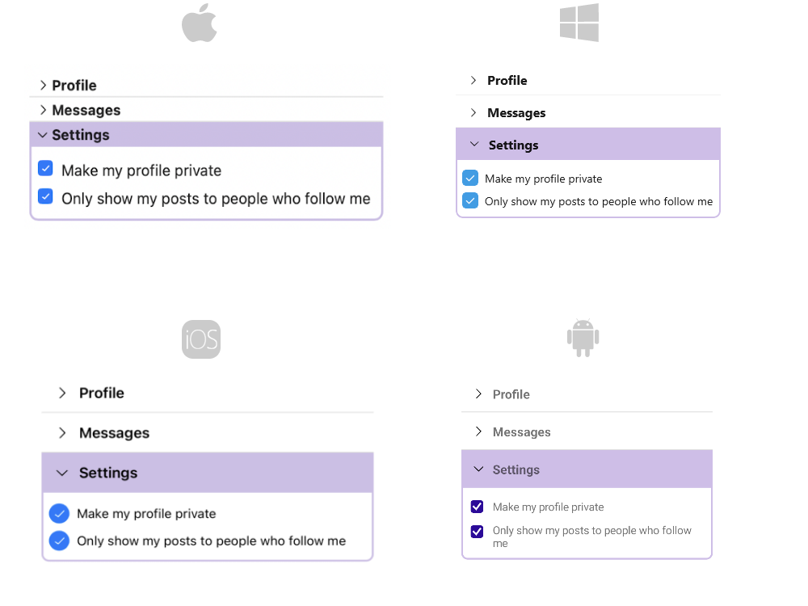

# .NET MAUI AccordionItem

This articles explains the configuration options of the Accordion Item.

## AccordionItem Header

You can either apply `HeaderText` property or use the `AccordionItemHeader` content control which provides a set of useful properties for customizing the look & feel of the Header.

The indicator is the small triangle that is rotated according to whether the `AccordionItem` control is expanded or collapsed. `AccordionItemHeader` provides various options for customizing the look of the indicator via the following properties:

* `IndicatorText`&mdash;The indicator is represented by a string symbol that can be changed through `IndicatorText` property;
* `IndicatorFontFamily`&mdash;Specifies the indicator text `FontFamily`;
* `IndicatorFontSize`&mdash;Defines the indicator text font size;
* `IndicatorColor`&mdash;Specifies sets the color of the indicator;
* `IndicatorLocation`(`ExpandCollapseIndicatorLocation`)&mdash;Positions the indicator to the left or to the right inside the Header;
* `IndicatorAnimationDuration`&mdash;Specifies the duration of the rotation animation of the indicator;
* `IndicatorAnimationEasing`&mdash;Specifies the easing of the rotation animation of the indicator;
* `IndicatorMargin`(`Thickness`)&mdash;Specifies the margin applied to the indicator;

## IsExpanded

Change the expanded state of the `AccordionItem` using the `IsExpanded`(`bool`)property.
	
## Border Styles

Use `BorderColor`, `BorderThickness` and `CornerRadius` properties of `RadAccordionItem` to change the way the Border around the control looks.

The following snippet shows how to customize the `AccordionItemHeader`:

<snippet id='accordion-features-accordionitem' />

Next image displays how the `RadAccordion` looks with thus defined items:

>important For the AccordionItem example refer to the [SDKBrowser Demo Application]().

## See Also

- [Expand and Collapse states]()
- [Item spacing]()
- [Animation]()
