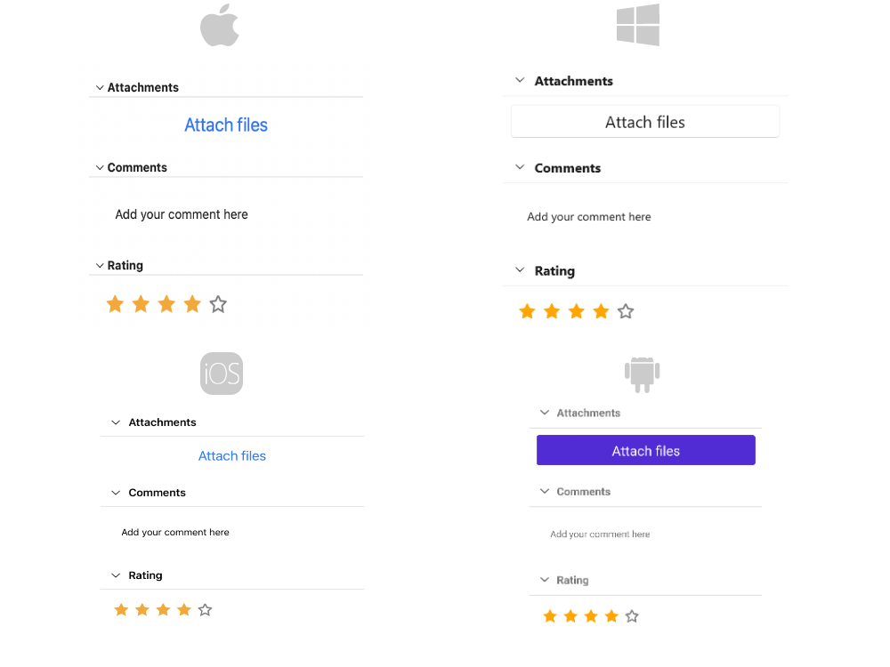

# .NET MAUI Accordion Animation

Telerik .NET MAUI Accordion provides an option to set the animation when expanding/collapsing an accordion item.

## Animation while Expanding/Collapsing

To enable or disable the animation, use the `IsAnimationEnabled` (`bool`) property of `RadAccordion`. By default, the Animation is enabled.

You can also customize the duration and easing through `AnimationDuration` and `AnimationEasing` properties.

* `AnimationDuration`(`int`)&mdash;Defines the duration of the animation while expanding/collapsing the `AccordionItem`. The default value is `500`.
* `AnimationEasing`(`Microsoft.Maui.Easing`)&mdash;Specifies animation acceleration over time. The default value is `Easing.Linear`.

## Example

The snippet below shows how the `AnimationDuration`, `AnimationEasing` properties can be applied:

<snippet id='accordion-key-features-xaml'/>

The image below shows the result after running the snippet:

And the `RadAccordion` when all items are collapsed:

>important For the Accordion Animation example refer to the [SDKBrowser Demo Application]().

## See Also

- [AccordionItem]()
- [Expand and Collapse states]()
- [Item spacing]()
