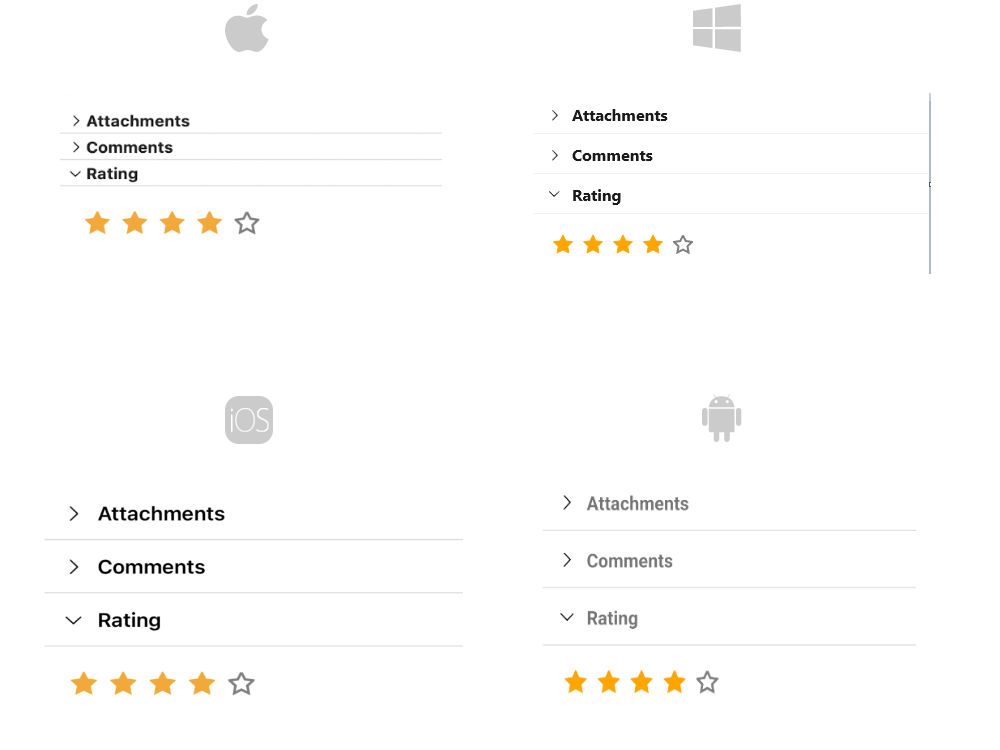

# Getting Started with .NET MAUI Accordion control

This guide provides the information you need to start using the Telerik UI for .NET MAUI Accordion by adding the control to your project.

At the end, you will be able to achieve the following result.

## Prerequisites

Before adding the Accordion, you need to:

1. [Set up your .NET MAUI application](#set-up-your-net-maui-application).

1. [Download Telerik UI for .NET MAUI](#download-telerik-ui-for-net-maui).

1. [Install Telerik UI for .NET MAUI](#install-telerik-ui-for-net-maui).

## Define the Control

When your .NET MAUI application is set up, you are ready to add a Accordion control to your page.

Here is the Accordion definition in XAML and C#:

<snippet id='accordion-getting-started-xaml' />
<snippet id='accordion-getting-started-csharp' />

And the items source for the suggestion list:

<snippet id='accordion-getting-started-items-source'/>

>important For the Accordion Getting Started example refer to the [SDKBrowser Demo Application]().

## Additional Resources

- [.NET MAUI Accordion product page](https://www.telerik.com/maui-ui/accordion)
- [.NET MAUI Accordion forum page](https://www.telerik.com/forums/maui?tagId=1978)
- [Telerik .NET MAUI blogs](https://www.telerik.com/blogs/mobile-net-maui)
- [Telerik .NET MAUI roadmap](https://www.telerik.com/support/whats-new/maui-ui/roadmap)

## See Also

- [Configuration]()
- [AccordionItem]()
