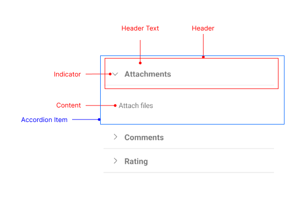

# .NET MAUI Accordion Visual Structure

The visual structure of the .NET MAUI Accordion represents the anatomy of the UI component. Being familiar with the visual elements of the Accordion allows you to quickly find the information required to configure them.

The following image shows the anatomy of the Accordion.

## Displayed Elements

* **Header**&mdash;Represents the header element of an Accordion item. The header has two main parts: the header text and the indicator. 
* **Header Text**&mdash;Represents the text part of the Accordion item header.
* **Indicator**&mdash;Represents the expand/collapse indicator of the Accordion item header.
* **Content**&mdash;Represents the content area of an Accordion item.
* **Accordion Item**&mdash;Represents a single item of the Accordion control, which includes the Header and the Content.

## See Also

* [Getting Started]()
* [Accordion Item Configuration]()
* [Expand and Collapse states]()
