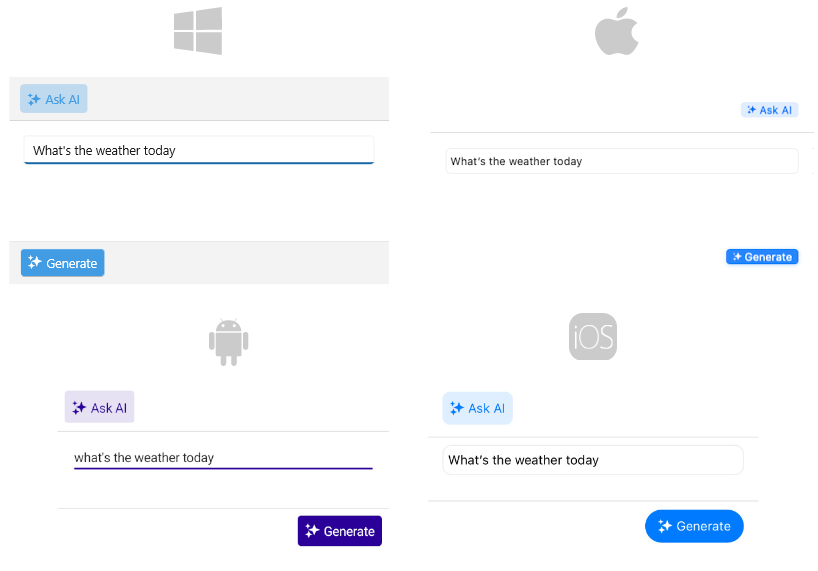

# Getting Started with the .NET MAUI AIPrompt

This guide provides the information you need to start using the Telerik UI for .NET MAUI AIPrompt by adding the control to your project.

At the end, you will achieve the following result.



## Prerequisites

Before adding the AIPrompt, you need to:

1. [Set up your .NET MAUI application](#step-1-set-up-your-net-maui-application).

1. [Download Telerik UI for .NET MAUI](#step-2-download-telerik-ui-for-net-maui).

1. [Install Telerik UI for .NET MAUI](#step-3-install-telerik-ui-for-net-maui).


## Define the Control

**1.** When your .NET MAUI application is set up, you are ready to add an AIPrompt control to your page.

 <snippet id='aiprompt-getting-started-xaml' />

**2.** Add the following namespace:

 ```XAML
 xmlns:telerik="http://schemas.telerik.com/2022/xaml/maui"
 ```

 **3.** Add the `ViewModel` class:

 <snippet id='aiprompt-getting-started-viewmodel' />

 **4.** Set the `ViewModel` as a `BindingContext` of the page:

 <snippet id='aiprompt-getting-started-setvm' />

 **5.** Register the Telerik controls through the `Telerik.Maui.Controls.Compatibility.UseTelerik` extension method called inside the `CreateMauiApp` method of the `MauiProgram.cs` file of your project:

```C#
using Telerik.Maui.Controls.Compatibility;

public static class MauiProgram
{
	public static MauiApp CreateMauiApp()
	{
		var builder = MauiApp.CreateBuilder();
		builder
			.UseTelerik()
			.UseMauiApp<App>()
			.ConfigureFonts(fonts =>
			{
				fonts.AddFont("OpenSans-Regular.ttf", "OpenSansRegular");
			});

		return builder.Build();
	}
}           
```

## See Also

- [Telerik .NET MAUI Blogs](https://www.telerik.com/blogs/mobile-net-maui)
- [Telerik .NET MAUI Roadmap](https://www.telerik.com/support/whats-new/maui-ui/roadmap)
