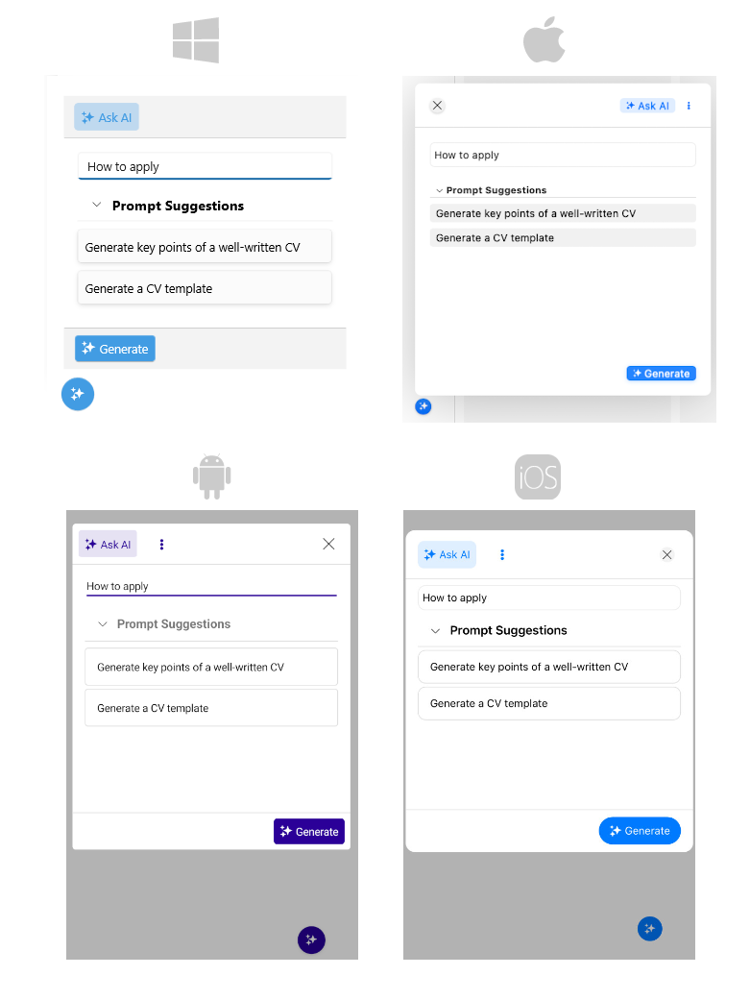

# .NET MAUI AIPrompt Overview

The .NET MAUI AIPrompt component helps you write input (prompt) instructing the Generative AI to produce the desired response.

The component allows you to interact with the output from the AI and execute a set of predefined commands. Furthermore, the AIPrompt comes with three predefined views—Input, Output, and Commands, as well as the option to define custom views. Users can navigate the views through the AIPrompt's TabView.

## Key Features

* [Views]()&mdash;The AIPrompt provides different views that you can include in it - Input, Output and Commands view. Through interaction with the component, the user can change the currently active view.
* [Suggestions]()&mdash;This collection will allow you to populate the AIPrompt component with suggestions that will be displayed to the user prior to sending the request.
* [Commands]()&mdash;The Commands collection gives you the ability to define custom commands with custom actions displayed within the Commands View.
* [AIPrompt button]()&mdash;The AIPrompt component provides the ability to display it as a button, which when interacted with, will display the prompt.
* Flexible Styling API&mdash;Thanks to the control’s flexible API you can directly configure how various elements of the Telerik UI for .NET MAUI AIPrompt are displayed in your application.

## Next Steps

- [Getting Started with Telerik UI for .NET MAUI AIPrompt]()

## See Also

- [Telerik .NET MAUI Blogs](https://www.telerik.com/forums/maui?tagId=2058)
- [Telerik .NET MAUI Roadmap](https://www.telerik.com/support/whats-new/maui-ui/roadmap)
