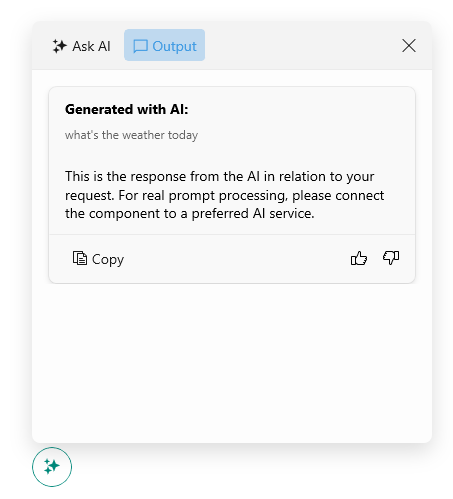

# AIPrompt Button Styling

The AIPrompt Button is used to show the AIPrompt inside a popup. You can customize the AIPrompt Button by setting its `Style` property with `TargetType` set to `RadTemplatedButton`.

The following example demonstrates how to modify the AIPrompt Button's appearance:

**1.** Add a `Style` property with the needed styling settings applied to the page's resources:

<snippet id='aiprompt-airpromtbutton-style'/>

**2.** Add the `RadAIPromptButton` control with its `Style` applied:

<snippet id='aiprompt-airpromtbutton-xaml'/>

Check the result below:

## See Also

- [AIPrompt Button]()
