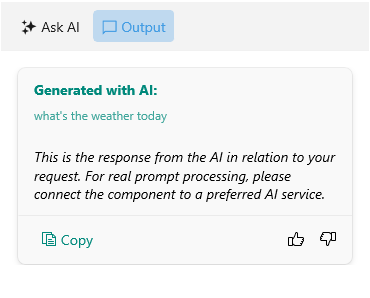

# Output View Styling

The Output View of the AIPrompt control provides the following customization property:

* `OutputItemStyle`(`Style`)&mdash;Defines the style that is to be applied to the output items.

The following example demonstrates how to modify the output items' appearance:

**1.** Add a `Style` property with `TargetType` set to `AIPromptOutputItemView` as well as additional `Style` properties for the various elements of each output item to the page's resources:

```XAML
 <Style x:Key="MyTitleStyle" TargetType="Label">
    <Setter Property="TextColor" Value="#00897B" />
</Style>
<Style x:Key="MySubtitleStyle" TargetType="Label">
    <Setter Property="TextColor" Value="#BF00897B" />
</Style>
<Style x:Key="MyResponseTextStyle" TargetType="Label">
    <Setter Property="FontAttributes" Value="Italic" />
</Style>
<Style x:Key="MyActionButtonStyle" TargetType="telerik:RadTemplatedButton">
    <Setter Property="TextColor" Value="#00897B" />
</Style>
<Style x:Key="MyOutputItemStyle" TargetType="telerik:AIPromptOutputItemView">
    <Setter Property="TitleLabelStyle" Value="{StaticResource MyTitleStyle}" />
    <Setter Property="InputTextLabelStyle" Value="{StaticResource MySubtitleStyle}" />
    <Setter Property="ResponseTextLabelStyle" Value="{StaticResource MyResponseTextStyle}" />
    <Setter Property="CopyButtonStyle" Value="{StaticResource MyActionButtonStyle}" />
    <Setter Property="RetryButtonStyle" Value="{StaticResource MyActionButtonStyle}" />
</Style>
```

**2.** Add the `RadAIPrompt` control with the above style properties applied:

<snippet id='aiprompt-outputview-styling-xaml'/>

Here is how the customized Output View looks:



## See Also

- [Views]()
- [Output View]()
