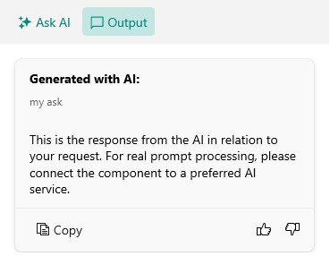

# TabView Styling

The AIPrompt control displays the available views (Input, Output, Commands) in a TabView. You can modify the visual appearance of the TabView and each TabView header through the `TabViewStyle` property of the control.

The following example demonstrates how to modify the visual states of the TabView headers through the `TabViewStyle` property:

**1.** Add a `Style` property with `TargetType` set to `RadTabView` to the page's resources:

<snippet id='aiprompt-tabviewstyling-style'/>

**2.** Add the `RadAIPrompt` control with `TabViewStyle` applied:

<snippet id='aiprompt-tabviewstyling-xaml'/>

Here is the result after applying the `TabViewStyle`:

## See Also

- [Views]()
