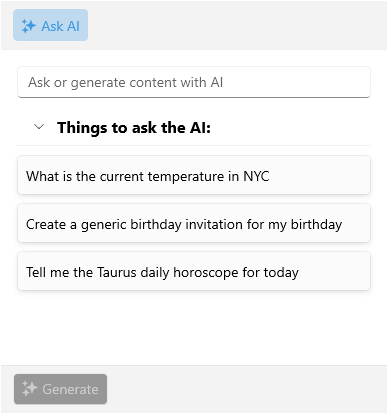

# Suggestions

The .NET MAUI AIPrompt control allows you to define suggestions for the user prior to initiating a request. To do so, set the `Suggestions` collection of the AIPrompt.

The user can select any of the available suggestions, which in turn will populate the input editor with the selected suggestion. This interaction will not trigger a response request right away&mdash;the user can modify the suggestion first.

The AIPrompt control exposes the following properties related to the suggestions displayed in the InputView:

* `SuggestionsHeaderText`(`string`)&mdash;Defines the text of the suggestions header.
* `Suggestions`(`IEnumerable`)&mdash;Sets the suggestions. The items of this collection can be simple string objects. In case more control over the UI is needed, the items in this collection can be objects from a custom class and the `SuggestionStyle` property can be used to set the `AIPromptInputSuggestionView`.`ControlTemplate`.

>For more details on how to modify the visual appearance of the Suggestions, go to [Suggestions Styling] topic.

Check a quick example on how to apply suggestions to the AIPrompt:

**1.** Add the AIPrompt definition with the `Suggestions` applied:

<snippet id='aiprompt-suggestions-xaml' />

**2.** Add the `ViewModel` class:

<snippet id='aiprompt-suggestions-viewmodel' />

**3.** Set the `ViewModel` as a `BindingContext` to the page:

<snippet id='aiprompt-getting-started-setvm' />

Here is the result on Windows:

## See Also

- [Views]()
- [Input View]()
- [Suggestions Styling]()
