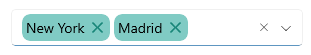
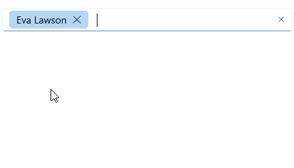

# .NET MAUI AutoComplete Commands

The .NET MAUI AutoComplete provides a `Reniv

## Remove Token Command

- `RemoveTokenCommand`(`ICommand`)&mdash;Removes a token from the AutoComplete selection in `Tokens` display mode. This command is called from the token's `DataTemplate` when the user taps the close button for removing the token.

>Go to [Tokens Support in .NET MAUI AutoComplete]() for detailed information on the `Tokens` display mode.

### Example with the default RemoveTokenCommand

The example below shows how you can call the default `RemoveTokenCommand` from a custom `TokenTemplate` implementation:

<snippet id='autocomplete-default-removetoken' />

### Example with a custom RemoveTokenCommand

The example demonstrates a custom `RemoveTokenCommand` implementation.

**1.** Create a custom command class that inherits from `AutoCompleteRemoveTokenCommand` and override, for example, its `Execute` method:

<snippet id='autocomplete-custom-removetokencommand' />

**2.** Apply the newly created command class to the `RadAutoComplete`'s `RemoveTokenCommand`:

<snippet id='autocomplete-custom-removetoken' />

## See Also

- [Tokens Support]()
- [Filtering]()
- [Methods]()
- [Templates]()
- [Styling]()