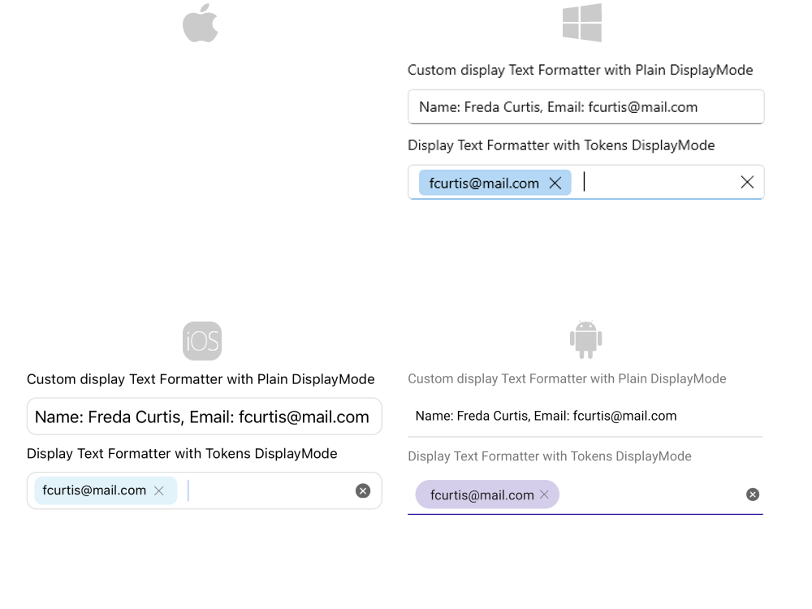

# .NET MAUI Autocomplete Display Text Formatting

The AutoComplete control provides the option to format the visualized text in the input, so you can modify the displayed details when item is get from the suggestion view. The format of the text can be defined when `AutoComplete` `DisplayMode` is `Plain` or `Tokens`:

* `DisplayTextFormatter`(IDisplayTextFormatter): Defines the formatter of the selected item.

To define the formatter of the selected item, you can use the following options:

* Set the `DisplayTextFortammer` property and define the name of the property from the business object which will be displayed after formatting.
* Create a custom class that inherits from `IDisplayTextFormatter` and implement a custom logic how the selected item can be formatted.

## Example

### DisplayText Formatter with DisplayMode Plain

Here is an example how the `RadAutoComplete` `DisplayTextFormatter` works on Plain `DisplayMode`:

**1.** Create the needed business objects, for example type Client with the following properties:

<snippet id='autocomplete-client-businessobject'/>

**2.** Create a ViewModel with a collection of Client objects:

<snippet id='autocomplete-clients-viewmodel'/>

**3.** Create a class, for example, `MyTextFormatter` that inherits from `Telerik.Maui.Controls.AutoComplete.IDisplayTextFormatter`:

<snippet id='autocomplete-text-formatter-plain-class'/>

**4.**Use the following snippet to declare a `RadAutoComplete` in XAML:

<snippet id='autocomplete-textformatter-plain'/>

### DisplayText Formatter with DisplayMode Token

Here is an example how the `RadAutoComplete` `DisplayTextFormatter` works on `Tokens`:

First, create the needed business objects, for example type Client with the following properties:

**1.** Create the needed business objects, for example type Client with the following properties:

<snippet id='autocomplete-client-businessobject'/>

**2.** Create a ViewModel with a collection of Client objects:

<snippet id='autocomplete-clients-viewmodel'/>

**3.** Use the following snippet to declare a `RadAutoComplete` in XAML:

<snippet id='autocomplete-textformatter-tokens'/>

Here is how the DisplayText Formatter looks in both cases:

>important For Autocomplete DisplayText Formatter example refer to the [SDKBrowser Demo application]().

## See Also

- [Data Binding]()
- [Configuration]()
- [Suggest Mode]()
- [Tokens Support]()
- [Remote Search]()
- [Filtering]()
- [Events]()
- [Methods]()
- [Templates]()
- [Styling]()
