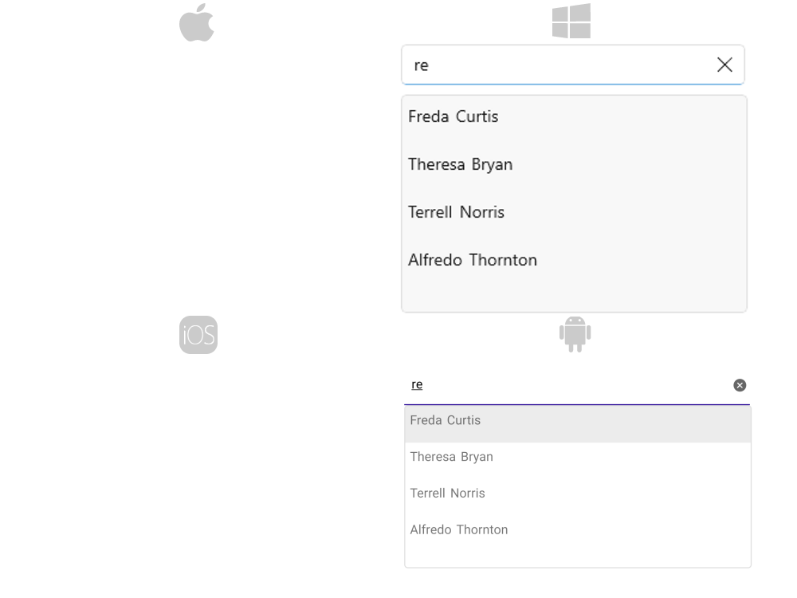

# .NET MAUI AutoComplete Filtering 

The Telerik .NET MAUI AutoComplete control filters the source by the entered text. By using the `CompletionMode` (enum of type `Telerik.Maui.Controls.AutoCompleteCompletionMode`) property you can specify how the `ItemsSource` will be filtered when the user types in the input area. The `StartsWith` filters the items that start with the text typed in the input area and the `Contains`&mdash;filters the items that contain the text typed in the input area.

The filtered items are stored in the `FilteredItems` collection, which can be accessed through the following property:

* `FilteredItems` (`IEnumerable`)&mdash;Allows you to get the collection containing the search results of the AutoComplete. The property can be used in scenarios where the search results are visualized at a different place or inside another container.

When filtering is performed and there are matching items, the items are displayed in the `SuggestionView`. By default, the first item in the `SuggestionView` is highlighted. To modify this behavior, you can use the following property:

* `HighlightItemFunc` (`Func<IEnumerable<object>, string, object>`)&mdash;Specifies the function used to specify the highlighted item in the drop-down after filtering is performed. The function receives the filtered collection of items and the current search text as parameters and returns the item from the filtered collection that should be highlighted.

**Example: Removing the highlighted item**

```C#
var autoComplete = new RadAutoComplete();
autoComplete.HighlightItemFunc = (filteredItems, searchText) => null;
```

**Example: Setting the highlighted item to the last item from the SuggestionView**

```C#
var autoComplete = new RadAutoComplete();
autoComplete.HighlightItemFunc = (filteredItems, searchText) => filteredItems.LastOrDefault();
```

## Custom Filtering

The control allows users to define custom filtering logic through the following property:

* `Filter` (`Telerik.Maui.Controls.AutoComplete.IAutoCompleteFilter`)&mdash;Defines the function that will be used to filter items. 

The `IAutoCompleteFilter` interface contains a `Filter` (`bool`) function that is called by the `RadAutoComplete` control to filter items. The Filter function provides the following properties:

* `item`&mdash;The item to be checked.
* `searchText`&mdash;The current text in the RadAutoComplete control.
* `completionMode`&mdash;The current `CompletionMode` of RadAutoComplete.

* `CompletionMode` of RadAutoComplete.

The function returns true when the item is added into RadAutoComplete `FilteredItems` collection, otherwise it returns false and the item won't be added into RadAutoComplete `FilteredItems` collection.

>The RadAutoComplete `TextSearchPath` property is required in custom filtering scenarios.


## Example

Here is an example how the AutoComplete Custom Filtering works when searching in two properties:

**1.** Create the needed business objects, for example type Person with the following properties:

<snippet id='autocomplete-person-businessobject'/>

**2.** Create a `CustomFilterViewModel` with a collection of Person objects:

<snippet id='autocomplete-filering-viewmodel'/>

**3.** Create a class for example `CustomAutoCompleteFilter` that implements the `IAutoCompleteFilter` interface:

<snippet id='autocomplete-filtering-class'/>

**4.** Use the following snippet to declare a RadAutoComplete in XAML:

<snippet id='autocomplete-customfiltering'/>

This is the result:



>important For AutoComplete Filtering example refer to the [SDKBrowser Demo application]().

## Handling Punctuation

By default, the .NET `string.Contains` method will take all punctuation into consideration. If you find punctuation to be hindering your user experience, you can use a custom filter that removes the punctuation before the strings are compared. 

For example, if the source string is `Main Street, 101` and the user searches `Main Street 101`, string.Contains will return false and the result will not appear in the FilteredItems view. The custom filter below removes the commas before the string is used with the Contains method.

```C#
public class CustomAutoCompleteFilter : IAutoCompleteFilter
{
    public bool Filter(object item, string searchText, AutoCompleteCompletionMode completionMode)
    {
        var googleSearchResult = (string)item;

        // Remove commas from the source value before comparing with the search term
        var googleSearchResultNoCommas = googleSearchResult.Replace(",", "");

        var normalizedPlace = googleSearchResultNoCommas.ToLowerInvariant();
        var normalizedSearchText = searchText.ToLowerInvariant();
        
        return normalizedPlace.Contains(normalizedSearchText);
    }
}
```

## See Also

- [Remote Search]()
- [Events]()
- [Methods]()
