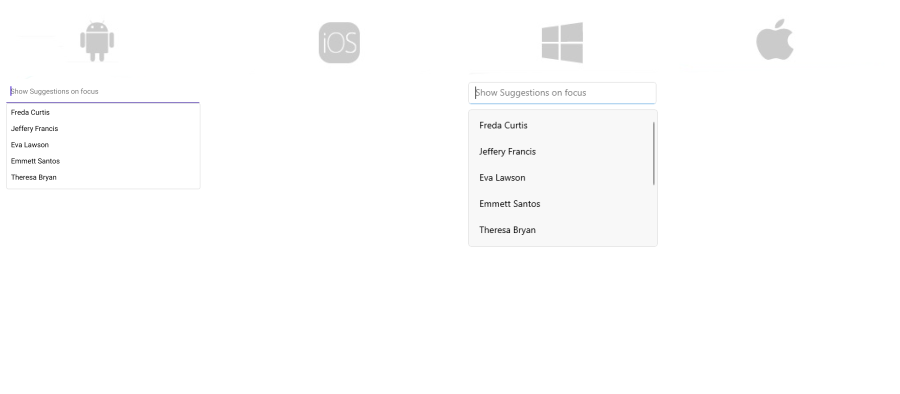

# .NET MAUI AutoComplete Methods

AutoComplete for .NET MAUI exposes the ability to explicitly show/hide the popup containing all items through the following methods:

* `ShowSuggesstions`&mdash;Shows all items when the control recieves focus.
* `HideSuggestions`&mdash;Hide all items when the focus of the control is lost.

## Example

The example below uses `ShowSuggesstions` method to display all items as soon as the AutoComplete receives the focus. 

**1.** Create the needed business objects, for example type Client with the following properties:

<snippet id='autocomplete-client-businessobject'/>

**2.** Define a ViewModel with a collection of Client objects:

<snippet id='autocomplete-clients-viewmodel'/>

**3.** Declare the RadAutoCompleteView in XAML:

<snippet id='autocomplete-data-binding'/>

**4.** Use the following code to attach the focused event to the control:

<snippet id='autocomplete-focused'/>

**5.** Call the `ShowSuggestions` method inside the Focused event:

<snippet id='autocomplete-showsuggestions'/>

Here is the result:

# See Also

