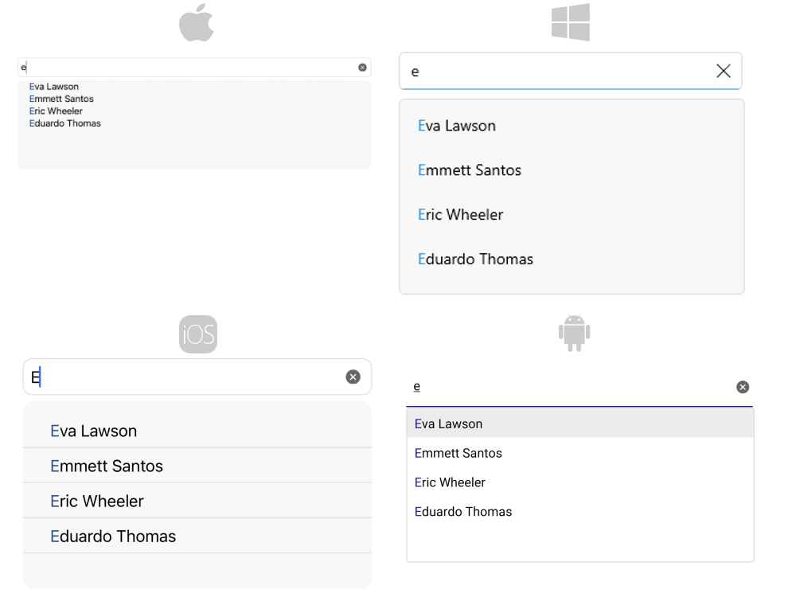

# .NET MAUI AutoComplete Overview

**Telerik UI for .NET MAUI AutoComplete** can automatically complete user input string by comparing the text being entered to all strings in the associated data source. The control has a number of advanced features such as different filtering options, tokens support and remote search, as well as full customization capabilities.

## Key features

* [Tokens Support]()&mdash;With AutoComplete you could enable users to search for and pick several items in one control.
* [Filtering Options]()&mdash;You could define the filtering behavior to display all the matches that either `StartsWith` or `Contains` the typed symbols.
* [Different Suggest Modes Support]()&mdash;RadAutoComplete exposes three different modes (Suggest, Append, SuggestAppend) for providing suggestions.
* [Placeholder](#placeholder)&mdash;Used to give guidance to the end user on what should be entered in the text input.
* [No results message](#no-results-message)&mdash;NoResults message appears in the popup used for the list of suggestions whenever the control cannot find any matching items.
* [Vizualized text formatting]()&mdash;You can control how the text is visualized when chosen an item from the suggestion view.
* [Custom Templates]()&mdash;If any of the default templates does not fit in a particular scenario, you can easily define a custom template.
* [Remote Search]()&mdash;Allows you to easily take the user input, trigger custom searching algorithm and assign the results to the ItemSource of the AutoComplete.
* [Suggestion view visibility](#suggestionview-visibility)&mdash;AutoComplete provides the ability to hide the view with the suggestions.
* [Highlight customization](#hightlight-customization)&mdash;You can customize the highlight color of the suggestion items.
* [Nested properties support]()&mdash;This allows binding of a complex object to the TextSearchPath property. 
* [Styling options]()&mdash;for changing the control's border brush and thickness, font options, suggestion item highlight text color and more

# Next Steps

- [Getting Started with Telerik UI for .NET MAUI AutoComplete]()

## See Also

- [.NET MAUI AutoComplete Product Page](https://www.telerik.com/maui-ui/autocomplete)
- [.NET MAUI AutoComplete Forum Page](https://www.telerik.com/forums/maui?tagId=1978)
- [Telerik .NET MAUI Blogs](https://www.telerik.com/blogs/mobile-net-maui)
- [Telerik .NET MAUI Roadmap](https://www.telerik.com/support/whats-new/maui-ui/roadmap)
