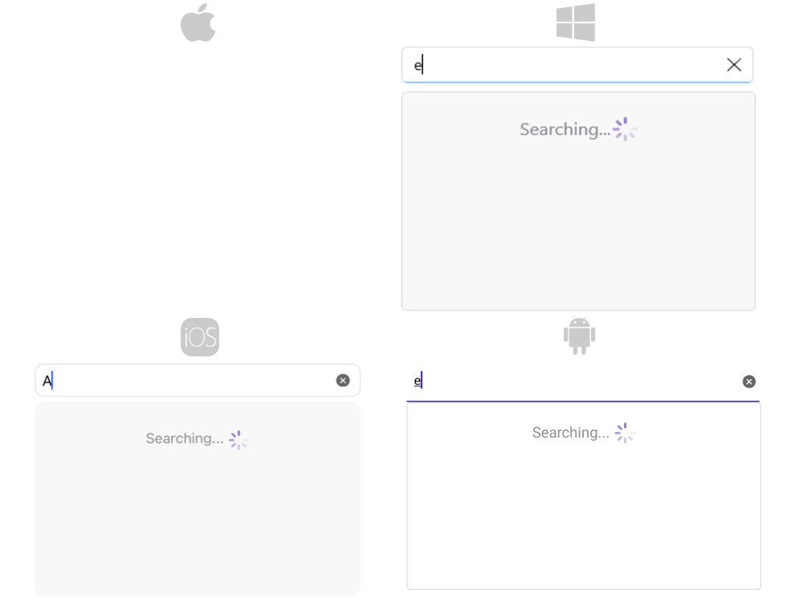
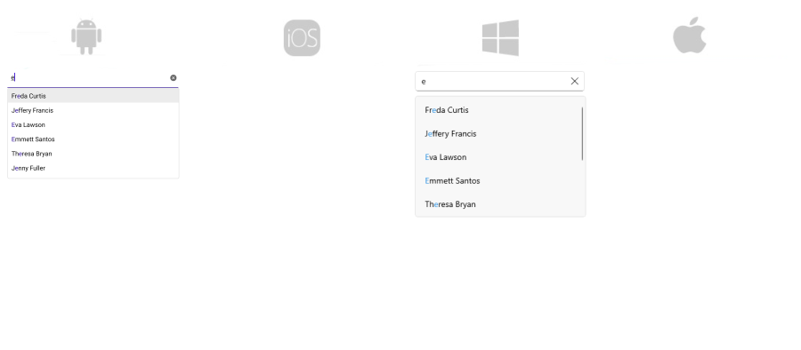

# Remote Search in .NET MAUI AutoComplete

The Remote Search functionality of the AutoComplete control allows you to take the user input, trigger custom searching algorithm and assign the results to the ItemSource of the control.

* `LoadingTemplate`(`DataTemplate`)&mdash;Defines the template of the loading view.

Implement your custom searching algorithm inside the body of the `TextChanged` event handler. 

## Example

Here is an example how the RadAutoComplete Remote Search works:

**1.** Create the needed business objects, for example type Client with the following properties:

<snippet id='autocomplete-client-businessobject'/>

**2.** Create a ViewModel with a collection of Client objects:

<snippet id='autocomplete-clients-viewmodel'/>

**3.** Use the following snippet to declare a RadAutoComplete in XAML:

<snippet id='autocomplete-remote-search'/>

**4.** Create a custom searching algorithm and assign the result to the control's `ItemsSource` inside the `TextChanged` event handler: 

<snippet id='autocomplete-remote-search-alorithm'/>

This is the result when `LoadingTemplate` is searching for results: 

This is the search complete results:

>important For the AutoComplete Remote Search example  refer to the [SDKBrowser Demo application]().

## See Also

- [Tokens Support]()
- [Filtering]()
- [Events]()
- [Methods]()
- [Templates]()
- [Styling]()
