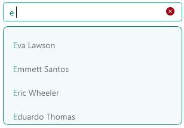
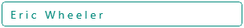
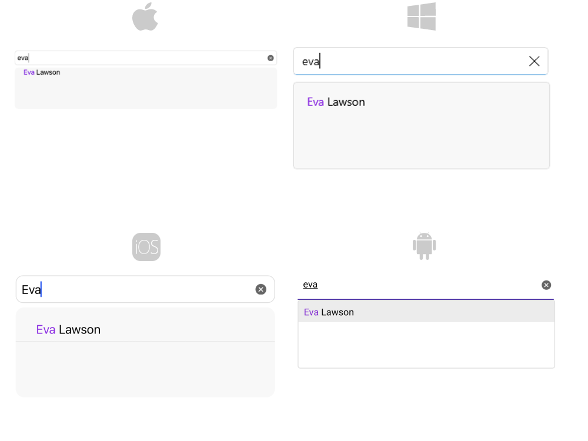

# .NET MAUI AutoComplete Styling

The Telerik UI for .NET MAUI AutoComplete control provides the following Style properties for customizing its look:

* `TextColor`(`Color`)&mdash;Defines the text color of the control.
* `PlaceholderColor`(`Color`)&mdash;Defines the color for the placeholder text.
* `Font Options`(`FontAttributes`, `FontFamily`, `FontSize`)&mdash;Defines the font options for the text of the AutoComplete.
* `BorderBrush`(`Brush`)&mdash;Defines the brush of the border around the control.
* `BorderThickness`(`Thickness`)&mdash;Defines the thickness of the border around the control.
* `FocusedBorderBrush`(`Brush`)&mdash;Defines the color of the border when the control is focused.
* `ClearButtonStyle` (of type `Style` with target type `Telerik.Maui.Controls.RadTemplatedButton`)&mdash;Defines the style for the clear button.
* `TextInputStyle`(of type `Style` with target type `Telerik.Maui.Controls.RadTextInput`)&mdash;Defines the style of the inner `RadTextInput` control.

In addition, you can change the visual appearance of the AutoComplete by defining the following visual states through the .NET MAUI Visual State Manager:

* `Normal`&mdash;Applied when the AutoComplete is in its normal state.
* `Focused`&mdash;Applied when the AutoComplete receives focus.
* (Windows Only)`MouseOver`&mdash;Applied when the mouse cursor is hovering over the AutoComplete.
* `Disabled`&mdash;Applied when the AutoComplete's `IsEnabled` is `False`.

## Suggestion View Styling 

The following properties style the AutoComplete SuggestionView (the dropdown with the suggestions):

* `SuggestionViewBackgroundColor`(`Color`)&mdash;Defines the background color of the SuggestionView.
* `SuggestionViewBorderColor`(`Color`)&mdash;Defines the color of the SuggestionView border.
* `SuggestionViewBorderThickness`&mdash;Defines the thickness of the border that surrounds the SuggestionView.
* `SuggestionViewCornerRadius`&mdash;Defines the corner radius applied to the SuggestionView.
* `SuggestionItemHighlightTextColor`&mdash;Defines the highlight color of the selection items.

### Example for AutoComplete Styling

The example below demonstrates some of the styling capabilities of the AutoComplete, such as custom `ClearButtonStyle`, `TextInputStyle`, `TextColor`, `PlaceholderColor`, and others. It also shows how to switch its appearance through the .NET MAUI Visual State Manager.

**1.** Add a Style that targets the `RadAutoComplete` to your page's resources and apply all the needed styling properties and the visual states:

<snippet id='autocomplete-custom-styles' />

**2.** Define the AutoComplete in XAML:

<snippet id='autocomplete-styling-xaml'/>

**3.** Create the needed business objects, for example type `Client` with the following properties:

<snippet id='autocomplete-client-businessobject'/>

**4.** Create a `ViewModel` with a collection of `Client` objects:

<snippet id='autocomplete-extended-clients-viewmodel'/>

Here is how the AutoComplete looks when styling is applied:

And when an item is selected:

## Highlight Customization

In case a custom template is used, the user can achieve text highlighting inside the `RadAutoComplete.SuggestionItemTemplate` using `RadHighlightLabel`.

The AutoComplete `RadHighlightLabel` exposes the following properties:

* `HighlightTextColor`
* `HighlightText`
* `UnformattedText`

Here is an example with `RadHighlightLabel`:

**1.** Create the needed business objects, for example type Client with the following properties:

<snippet id='autocomplete-client-businessobject'/>

**2.** Create a ViewModel with a collection of Client objects:

<snippet id='autocomplete-clients-viewmodel'/>

**3.** Use the following snippet to declare a RadAutoComplete in XAML with `RadHighlightLabel`:

<snippet id='autocomplete-highlight-text-behavior'/>

Here is the result:

>important For AutoComplete HighlightText example refer to the [SDKBrowser Demo application]().

## See Also

- [Data Binding]()
- [Configuration]()
- [Suggest Mode]()
- [Display Text]()
- [Tokens Support]()
- [Filtering]()
- [Templates]()
