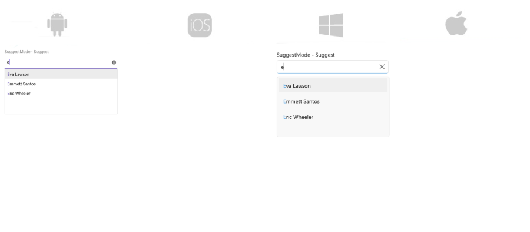
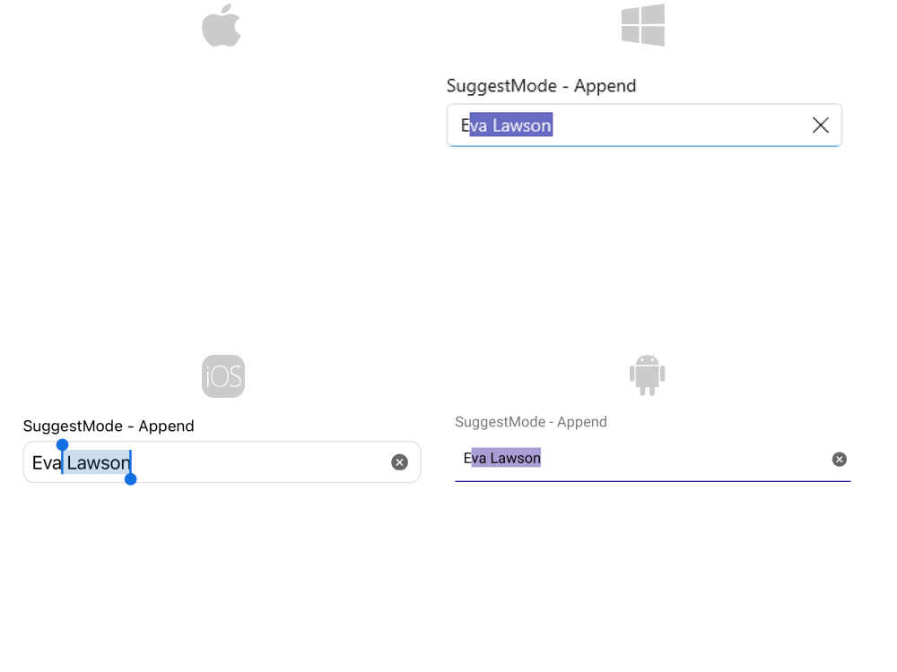
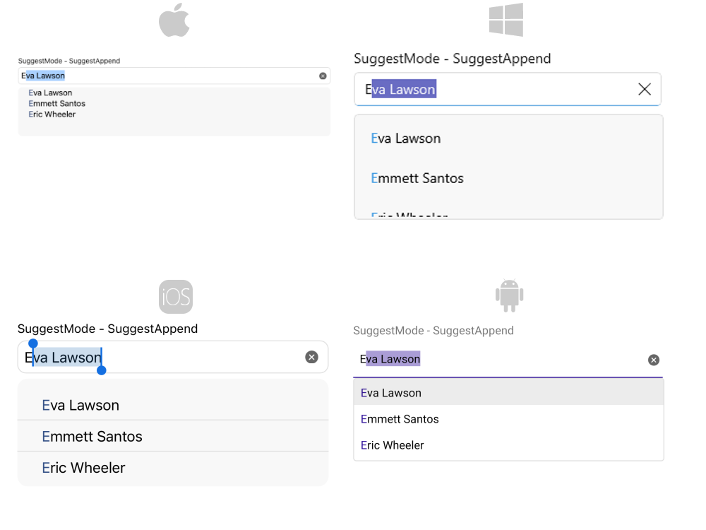

# Suggest Modes in .NET MAUI AutoComplete

AutoComplete exposes three different modes for providing suggestions:

* `Suggest`&mdash;Provides a drop-down list of options for you to pick from;
* `Append`&mdash;Provides an inline display of the first suggestion;
* `SuggestAppend`&mdash;Combines the functionality of the two options above, shows a drop-down with suggestions and at the same time selects the first one from the list. 

In order to choose any of those modes use the `SuggestMode` property of the control. The default `SuggestMode` is `Suggest`. 

## Example

Here is an example how the AutoComplete Suggest Mode functionality works:

Create the needed business objects, for example type Client with the following properties:

<snippet id='autocomplete-client-businessobject'/>

Create a ViewModel with a collection of Client objects:

<snippet id='autocomplete-clients-viewmodel'/>

**Example when `SuggestMode="Suggest"`**:

<snippet id='autocomplete-suggestmode-suggest'/>

Here is the result when `SuggestMode` is set to `Suggest`:

**Exmaple when `SuggestMode="Append"`**:

<snippet id='autocomplete-suggestmode-append'/>

And the final result:

**Example when `SuggestMode="SuggestAppend"`**:

<snippet id='autocomplete-suggestmode-suggest-append'/>

Here is the result:

>important For AutoComplete Suggest Mode example refer the [SDKBrowser Demo application]().

# See Also

- [Display Text]()
- [Tokens Support]()
- [Remote Search]()
- [Filtering]()
- [Events]()
- [Methods]()
- [Templates]()
- [Styling]()