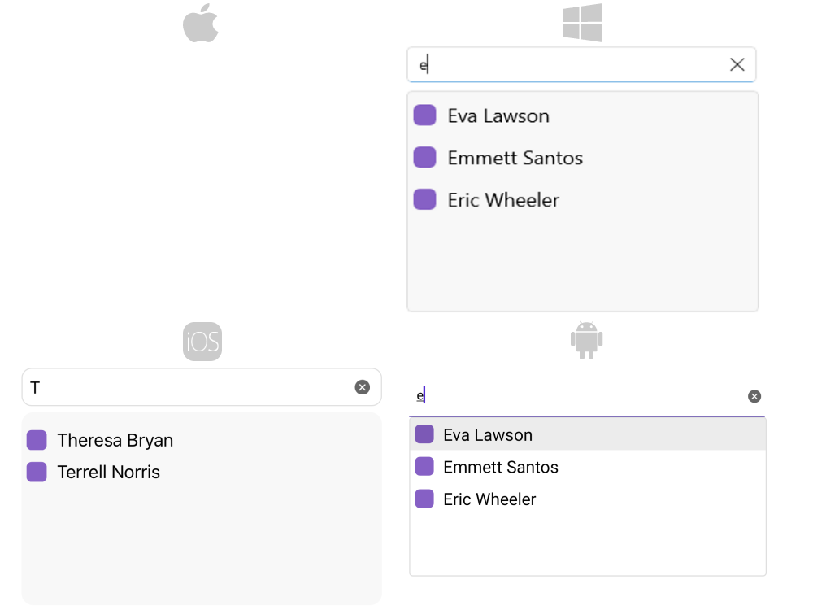

# Suggestion Items Customization

Whenever the default template does not fit a particular scenario you can use the `SuggestionItemTemplate`.

* `SuggestionItemTemplate`(`DataTemplate`)&mdash;Defines the template that will be used to create each of the suggestions.

The default suggestion view provides platform accessibility semantics for its items on WinUI and MacCatalyst. When defining a custom `SuggestionItemTemplate`, set meaningful `SemanticProperties.Description` or `SemanticProperties.Hint` values on the custom content when the displayed content does not provide an adequate announcement for a screen reader.

## Example

Here is an example how to use the RadAutoComplete `SuggestionItemTemplate`:

**1.** Create the needed business objects, for example type City with the following properties:

<snippet id='autocomplete-client-businessobject'/>

**2.** Create a ViewModel with a collection of City objects:

<snippet id='autocomplete-clients-viewmodel'/>

**3.** The following snippet shows the `SuggestionItemTemplate`:

<snippet id='autocomplete-suggestion-item-template'/>

Here is the result:

>important For AutoComplete SuggestionItemTemplate example refer to the [SDKBrowser Demo application]().

## See Also

- [Remote Search]()
- [Filtering]()
- [Templates]()
- [Styling]()