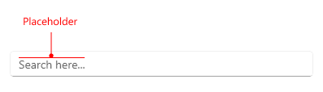
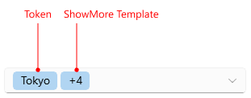
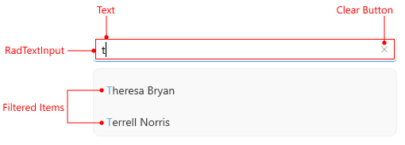

# .NET MAUI AutoComplete Visual Structure

The visual structure of the [.NET MAUI AutoComplete]() represents the anatomy of the UI control. Being familiar with the visual elements of the AutoComplete allows you to quickly find the information required to configure them.

The images in this article show the anatomy of the AutoComplete and its building blocks.

- `Placeholder`&mdash;The text that guides the end-user on what can be entered/searched in the input.

## Tokens Structure

- `Tokens`&mdash;When multiple items are selected from the dropdown list, these items appear as tokens. They can be deselected using their close button.
- `ShowMore Template`&mdash;This template represents a UI that is displayed when the control is not focused and the space is insufficient to show all tokens in a multiple selection scenario.

## Filtering Structure

- `Text`&mdash;The text entered in the control's input filed.
- [`RadTextInput`]()&mdash;The control used for the text input.
- `Clear Button`&mdash;Clears the selection in the control (for both multiple and single selection scenarios).
- `Filtered Items`&mdash;The items that are displayed after filtering the `ItemsSource` of the AutoComplete control.
