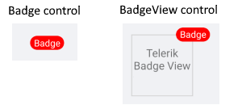

# Badge Indicator

The Badge is the indicator (or marker) which is displayed to show notifications, statuses, and so on, while the BadgeView is the control in which you can add content and position the Badge based on this content.

>important To provide the best experience use the [BadgeView]() control. The control gives you the option to add elements in the BadgeView content and display a badge indicator for this view. You can customize the badge directly in the BadgeView.

The following image shows the difference between the BadgeView control and the Badge indicator.



## Badge Features

The Badge indicator provides the following properties:

* `Text`(`string`)&mdash;Defines the Badge text.
* `TextColor`(`Microsoft.Maui.Graphics.Color`)&mdash;Defines the text color of the Badge.
* `TextMargin`(`Microsoft.Maui.Thickness`)&mdash;Defines the margin of the Badge text.
* `FontSize`(`double`)&mdash;Defines the Badge text font size.
* `FontFamily`(`string`)&mdash;Defines the Badge text font family.
* `FontAttributes`(`Microsoft.Maui.Controls.FontAttributes`)&mdash;Defines the Badge text font attributes.
* `BorderColor`(`Microsoft.Maui.Graphics.Color`)&mdash;Defines the Badge border color.
* `CornerRadius`(`Microsoft.Maui.Thickness`)&mdash;Defines the corner radius of the Badge border.
* `BorderThickness`(`Microsoft.Maui.Thickness`)&mdash;Defines the Badge border thickness.
* `AnimationType`(`Telerik.Maui.Controls.BadgeView.BadgeAnimationType`)&mdash;You can choose between `Scale` and `None`. The default value is `Scale`.
* `AnimationEasing`(`Microsoft.Maui.Easing`)&mdash;Defines the animation easing. For more details about different easing options, refer to the article on [`Microsoft.Maui.Easing`](https://docs.microsoft.com/en-us/dotnet/maui/user-interface/animation/easing). The default value is `SinInOut`.
* `AnimationDuration` in milliseconds(`int`)&mdash;Defines the animation duration in milliseconds. The default value is 300.
* `ControlTemplate`(`Microsoft.Maui.Controls.ControlTemplate`)&mdash;Specifies the Badge control template.

## Define the Badge

The following example demonstrates how to define the Badge in XAML:

```XAML
<telerik:Badge/>
```

Add the namespace:

```XAML
xmlns:telerik="http://schemas.telerik.com/2022/xaml/maui"
```

## Use the Default ControlTemplate

The default Badge `ControlTemplate` definition in XAML is the following:

<snippet id='badgeview-badge-control-template'/>

Define the Badge in the following way:

```XAML
<telerik:Badge/>
```

## See Also

- [Overview]()
- [Getting Started]()
- [Badge Position and Alignment]()
- [Badge Animation]()
- [Badge Types]()
- [Badge Styling]()
- [Badge Customization]()
