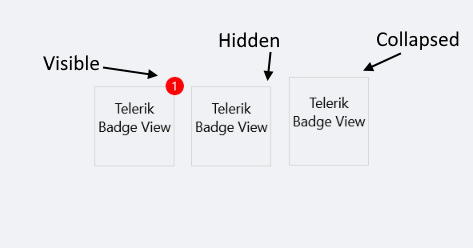
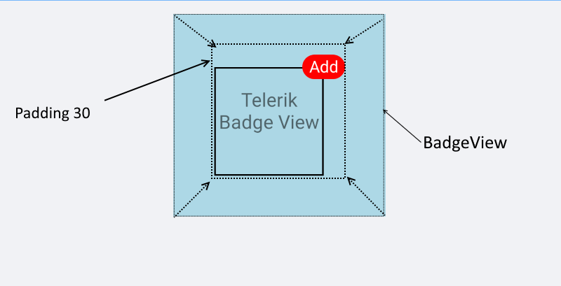

# Configure the .NET MAUI BadgeView

This article demonstrates the main configuration options of the Telerik UI for .NET MAUI BadgeView control.

## Content

The BadgeView exposes the `Content`(of type `Microsoft.Maui.Controls.View`) property, which defines its content. The Badge marker/indicator is positioned based on the content inside the BadgeView.

>important You are required to define content for the BadgeView by setting its `Content` property. Otherwise, the control will not be visualized.

```XAML
<telerik:RadBadgeView>
    <telerik:RadBadgeView.Content>
        <!-- Add the content of the BadgeView. For exmaple: Label, Image, Frame, Border, Button, and so on. -->
    </telerik:RadBadgeView.Content>
</telerik:RadBadgeView>
```

### Example

The example demonstrates how to set the content of the BadgeView and features a Button inside the `Content`. The BadgeText will be updated on a `ButtonClick`.  

<snippet id='badgeview-content'/>

The following snippet demonstrates the code behind with the button click implementation:

<snippet id='badgeview-content-code-behind'/>

The following image shows the final result.


## Badge Text

To define some text in the BadgeView, set the `BadgeText` property(`string`). The text will be displayed in the Badge indicator.

```XAML
<telerik:RadBadgeView BadgeText="Badge Text">
    <telerik:RadBadgeView.Content>
        <telerik:RadBorder WidthRequest="80"
						   HeightRequest="80"
						   BorderThickness="1"
						   BorderColor="LightGray">
            <Label Text="Telerik BadgeView for .NET MAUI"
                   FontSize="14"
                   VerticalTextAlignment="Center"
                   HorizontalTextAlignment="Center"/>
        </telerik:RadBorder>
    </telerik:RadBadgeView.Content>
</telerik:RadBadgeView>
```

The following image shows the final result.


>tip You can fully customize the look and feel of the BadgeView. For detailed information, refer to articles on [BadgeView styling]() and [customization]().

## Badge Visibility

To change the visibility state of the Badge indicator, use the `BadgeVisibility` property (enum of type `Microsoft.Maui.Visibility`).

The following options are supported:

* (Default) `Visible`&mdash;The Badge marker/indicator is visualized.
* `Hidden`&mdash;The Badge marker/indicator is hidden.
* `Collapsed`&mdash;The Badge marker/indicator is collapsed.

### Example

The following example demonstrates how to hide the `BadgeVisibility` state.

```XAML
<telerik:RadBadgeView BadgeText="1" BadgeVisibility="Hidden">
    <telerik:RadBadgeView.Content>
        <telerik:RadBorder WidthRequest="80"
						   HeightRequest="80"
						   BorderThickness="1"
						   BorderColor="LightGray">
            <Label Text="Telerik Badge View for Xamarin"
                FontSize="14"
                VerticalTextAlignment="Center"
                HorizontalTextAlignment="Center"/>
        </telerik:RadBorder>
    </telerik:RadBadgeView.Content>
</telerik:RadBadgeView>
```

The following image shows the final result.




## Padding

The BadgeView provides the `Padding`(`Xamarin.Forms.Thickness`) property, which defines its inner padding.

```XAML
 <telerik:RadBadgeView BadgeText="Add" Padding="30">
	 <telerik:RadBadgeView.Content>
	 <!-- add your content here -->
	 </telerik:RadBadgeView.Content>
 </telerik:RadBadgeView>
```

The following image shows the result.



## See Also

- [Badge Position and Alignment]()
- [Badge Animation]()
- [Badge Types]()
- [Badge Styling]()
- [Badge Customization]()
