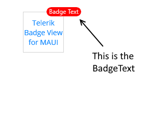
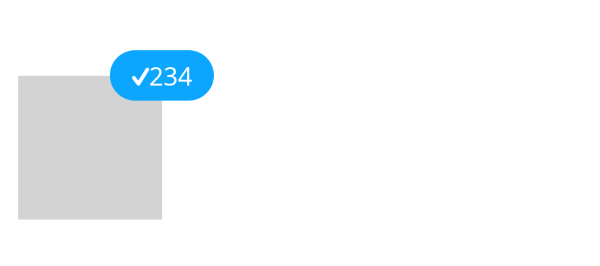

# Customization

If you don't want to use a [predefined Badge type]() and need to customize the text inside the Badge indicator, use the `BadgeText`(`string`) property.

```XAML
<telerik:RadBadgeView BadgeText="Badge Text">
    <telerik:RadBadgeView.Content>
        <telerik:RadBorder WidthRequest="80"
                                     HeightRequest="80"
                                     BorderThickness="1"
                                     BorderColor="LightGray">
            <Label Text="Telerik Badge View for MAUI"
                   FontSize="14"
                   VerticalTextAlignment="Center"
                   HorizontalTextAlignment="Center"/>
        </telerik:RadBorder>
    </telerik:RadBadgeView.Content>
</telerik:RadBadgeView>
```

The following image shows the final result.



## ControlTemplate

The BadgeView supports a default `ControlTemplate` which you can customize.

>important To override the default control template, you need to set an implicit style with `TargetType="telerik:Badge"`.

### Use the Default ControlTemplate

To use the default `ControlTemplate`:

1. Set the default `ControlTemplate` in the page resources:

 <snippet id='badgeview-badge-control-template'/>

1. The following snippet shows the BadgeView definition in XAML:

 <snippet id='badgeview-controltemplate'/>

1. Add the `telerik` namespace:

 ```XAML
xmlns:telerik="http://schemas.telerik.com/2022/xaml/maui"

 ```

The following image shows the final result.


### Use a Custom ControlTemplate

To customize the `ControlTemplate`:

1. Define the custom `ControlTemplate` in the page resources:

 <snippet id='badgeview-badge-custom-control-template'/>

1. The following snippet shows the BadgeView definition in XAML:

 <snippet id='badgeview-custom-controltemplate'/>

1. Add the following namespace:

 ```XAML
xmlns:telerik="http://schemas.telerik.com/2022/xaml/maui"
 ```

The following image shows the final result.



> For a Badge ControlTemplate example, go to the [SDKBrowser Demo Application]() and navigate to BadgeView -> Features category.

## See Also

- [Badge Position and Alignment]()
- [Badge Animation]()
- [Badge Types]()
