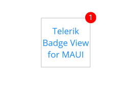

# Getting Started

This guide provides the information you need to start using the Telerik UI for .NET MAUI BadgeView by adding the control to your project.

At the end, you will be able to achieve the following result.



## Prerequisites

Before adding the BadgeView, you need to:

1. [Set up your .NET MAUI application](#set-up-your-net-maui-application).

1. [Download Telerik UI for .NET MAUI](#download-telerik-ui-for-net-maui).

1. [Install Telerik UI for .NET MAUI](#install-telerik-ui-for-net-maui).

## Define the Control

1. When the your .NET MAUI application is set up, you are ready to add a **RadBadgeView** control to your page. 

 ```XAML
<telerikPrimitives:RadBadgeView/>
 ```
 ```C#
var badge = new RadBadgeView();
 ```

1. Add the following namespace:

 ```XAML
xmlns:telerikPrimitives="clr-namespace:Telerik.XamarinForms.Primitives;assembly=Telerik.Maui.Controls.Compatibility"
 ````

1. Set `Content` and `BadgeText` properties:

>important The Badge marker(indicator) which is part of the RadBadgeView will be visualized only if RadBadgeView `Content` property is set. 

<snippet id='badgeview-getting-started-xaml'/>
<snippet id='badgeview-getting-started-csharp'/>

>important BadgeView Getting Started examples can be found in [SDKBrowser Demo Application]().

## See Also

- [Configuration]()
- [Badge Position and Alignment]()
- [Badge Animation]()
- [Badge Types]()
