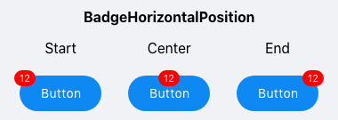
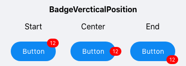
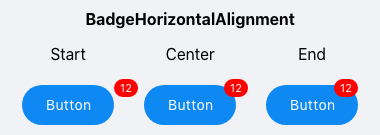
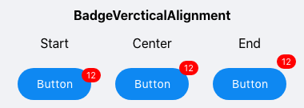

# Align and Position the .NET MAUI BadgeView

The BadgeView provides properties for setting the alignment and position of the Badge indicator based on the BadgeView `Content`.

## Positioning the Badge

To specify the position of the Badge according to its content, use the following properties:

* `BadgeHorizontalPosition`(of type `Telerik.Maui.Controls.BadgeView.BadgePosition`)&mdash;Specifies the horizontal `BadgePosition` of the Badge. The supported options are: `Start`, `Center`, `End`. The default value is `End`.

  

* `BadgeVerticalPosition`(of type `Telerik.Maui.Controls.BadgeView.BadgePosition`)&mdash;Specifies the vertical `BadgePosition` of the Badge. The supported options are: `Start`, `Center`, `End`. The default value is `Start`.

  

## Aligning the Badge

To specify the alignment of the Badge according to its content, use the following properties:  

* `BadgeHorizontalAlignment`(of type `Telerik.Maui.Controls.BadgeView.BadgeAlignment`)&mdash;Specifies the horizontal alignment of the badge. The supported options are: `Start`, `Center`, `End`. The default value is `Center`.

  

* `BadgeVerticalAlignment`(of type `Telerik.Maui.Controls.BadgeView.BadgeAlignment`)&mdash;Specifies the vertical alignment of the Badge. The supported options are: `Start`, `Center`, `End`. The default value is `End`.

  

## Offset

You can also specify the horizontal and vertical distance between the content of the Badge indicator and its alignment point by using the following properties:  

* `BadgeOffsetX`(`double`)&mdash;Specifies the horizontal distance between the content of the Badge and its alignment point. The default value is `0`.

* `BadgeOffsetY`(`double`)&mdash;Specifies the vertical distance between the content of the Badge and its alignment point. The default value is `0`.

## Example

The following example demonstrates how to position and align the Badge as well as set its offset.

<snippet id='badgeview-align-position-offset'/>

The following image shows the final result.

## See Also

- [Badge Animation]()
- [Predefined Badges]()
