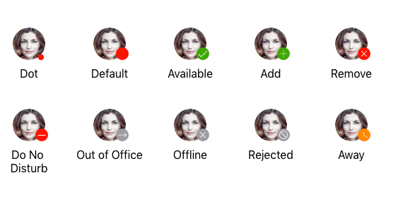
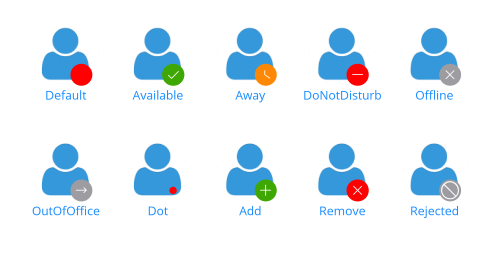

# Badge Types

The `BadgeView` supports a set of Badge indicator types.  



To change and specify the Badge type, use the `BadgeType`(of type `Telerik.Maui.Controls.BadgeView.BadgeType`) property, which exposes the following options:

* (Default) `Default`
* `Available`
* `Away`
* `DoNotDisturb`
* `Offline`
* `OutOfOffice`
* `Dot`
* `Add`
* `Remove`
* `Rejected`

The following example demonstrates how to set the type of the Badge indicator.

**1.** Define the BadgeView:

<snippet id='badgeview-badge-types'/>

**2.** Use the `telerik` namespace:

```XAML
xmlns:telerik="http://schemas.telerik.com/2022/xaml/maui"                    
```

The following image shows the final result.



> For a runnable example with the Badge Types scenario, see the [SDKBrowser Demo Application]() and go to **BadgeView -> Features category**.


## See Also

- [Configuration]()
- [Badge Position, Alignment and Offset]()
- [Badge Animation]()
- [Styling]()
- [Customization]()
