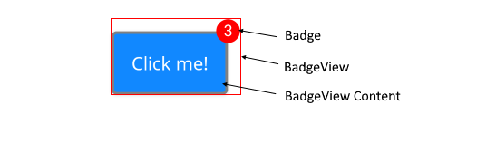

# .NET MAUI BadgeView Visual Structure

The visual structure of the .NET MAUI BadgeView represents the anatomy of the UI component. Being familiar with the visual elements of the BadgeView allows you to quickly find the information required to configure them.

The following image shows the anatomy of the BadgeView.

## Displayed Elements

* **BadgeView**&mdash;The BadgeView control which includes the Badge marker (indicator) and the content to which the marker is related.
* **Badge**&mdash;The marker that can be used for notifications, statuses, and so on.
* **BadgeView Content**&mdash;The Badge indicator is positioned based on the content inside the BadgeView. Without defined content, the Badge won't be visualized.

## See Also

- [Getting Started]()
- [Configuration]()
- [Badge Position and Alignment]()
- [Badge Animation]()
- [Badge Types]()
