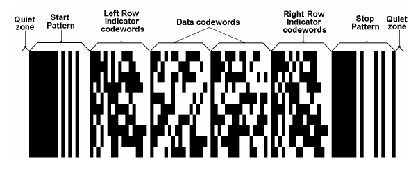
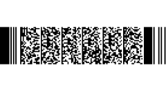

# PDF417

PDF417 is a stacked linear barcode symbol format used in a variety of applications, primarily transport, identification cards, and inventory management.

PDF stands for Portable Data File. The 417 signifies that each pattern in the code consists of four bars and spaces, and that each pattern is 17 units long. The PDF417 symbology was invented by Dr. Ynjiun P. Wang at Symbol Technologies in 1991 (Wang 1993). It is represented by the 15438 ISO standard.

The following image demonstrates a PDF417 Barcode.


## Visual Structure

The code is divided into rows and columns, which accommodate all the encoded data, the error correction code words, as well as any additional format information, such as start and stop sequences.

The following image shows the structure of a PDF417 Barcode.



The Data codewords are located in the middle section of the barcode and include the following sections:

* The length indicator cluster (each cluster contains 17 modules), which signifies the total length of the data code words.
* The actual data, which represents the data initially entered by the user, encoded.
* Error correction clusters, which help the decoder in recovering any data from the code.
* Padding clusters&mdash;Since a rectangular matrix is allocated for the data code words, to fill any gaps in the available matrix, it may become necessary to pad the data and add one or more clusters.

The Left Row Indicator codewords, as well as the Right Row Indicator codewords help the decoder locate each row. Essentially the row indicators represent an encoding of the row number.

The Start and Stop patterns are present on each row in the PDF417. The signal when the data and row indicators start and end. Each start/stop cluster is identical for each row.

Additionally, next to each side of the PDF417 barcode two or more modules, dedicated to the quiet zone, are rendered. This provides space and separates the barcode from other visual elements on the page, allowing the user to more reliably detect it.

## Example

The following example demonstrates a Barcode with an applied PDF417 symbology:

Define the Barcode and apply the PDF417 symbology:

<snippet id='barcodepdf-example-xaml' />

Add the `telerik` namespace:

```XAML
xmlns:telerik="http://schemas.telerik.com/2022/xaml/maui"
```

The following image shows the result of the suggested implementation.



## See Also

- [2D Barcodes Overview]()
