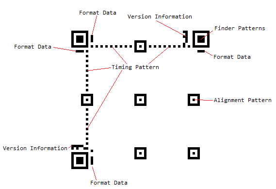
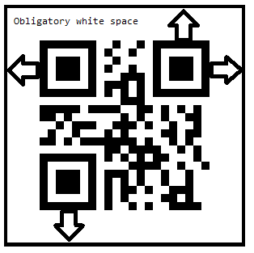

# QR Code

A QR Code (Quick Response Code) is the trademark for a type of matrix barcode first designed for the automotive industry in Japan. The QR Code system has become popular outside the automotive industry due to its fast readability and greater storage capacity compared to standard UPC barcodes.

A QR code consists of black modules (square dots) arranged in a square grid on a white background, which can be read by an imaging device (such as a camera) and processed by using a Reed–Solomon error correction until the image can be appropriately interpreted. The required data is then extracted from patterns that are present in both the horizontal and vertical components of the image.

A QR code uses four standardized encoding modes to efficiently store data—Numeric, alphanumeric, byte/binary, and kanji.

## Visual Structure

The Visual Structure has a total of 40 versions available in the QR code, from 21 by 21 modules to 177 by 177 modules, increasing in steps of four modules per side. Naturally, higher versions are used to encode larger amounts of data:

The `Version`(`int`) property defines the version of the QR code. The version determines the size of the QR code and the amount of information that can be encoded. Accepted values are in the range from 1 to 40. If you set the version to a number outside of this range, the version will be calculated automatically.


Disregarding the data, which consists the encoded data, along with the error correction bits, the structure of the code includes the following module groups:



* Finder Pattern—The finder pattern is a concentric square of alternating colors, located in all corners of the symbol except the bottom right. They are used by decoders to follow the orientation. The center is a 3x3 black square and is surrounded by a one-module-thick white box, which is surrounded by a one-module-thick black box, making the full pattern 7x7 modules.
* Alignment Pattern—The alignment pattern is only included in the rendered QR code in version 2 and above. Its purpose is to allow the decoder to scan a skewed image, and convert it to the virtual grid of black and white modules, representing the encoded data. The alignment pattern is made of concentric squares, like the finder patterns, with the center being a single black module.
* Timing Pattern—The timing pattern is an alternating stripe of black and white modules, starting at the lower left corner of the upper right Finder Pattern, going horizontally to the upper left finder pattern and then going vertically to the lower left finder pattern.
* Format Data—The format data is information about the Masking rule used in the QR Code along with the error correction level. When the data in the QR code is encoded, some of the modules are inverted following a predefined rule to improve readability and ensure that has no big clusters of same-colored modules. This process is called masking, and the masking information is included in the format data, to alert the decoder that some modules have been inverted.

  The format data is encoded in 15 bits. One full copy of the format data is located around the upper left finder pattern. A second copy, divided into 7 and 8 bits, is located next to the other two finder patterns.

* Version Data—The version data includes information on which version the QR code is. This data is encoded into 18 modules, in a 6 by 3 matrix. Two copies of the version data matrix are included in the QR code: one next to the upper right finder pattern and the other next to the lower left one.
* Blank Space—Additionally, around each QR code, has an obligatory 4-modules-wide space area:

  

* Data—The data occupies all available modules that are not occupied by any of the formatting data segments. If the data is less than the capacity of the remaining modules, it is padded to ensure that all modules are used. Additionally, the data consists of the encoded data, entered by the user, and the error correction bits, calculated on that data.

## Example

The following example demonstrates a Barcode with an applied QR Code symbology.

Define the Barcode and apply the QR Code symbology:

```XAML
<telerik:RadBarcode x:Name="barcode"
                    Value="https://docs.telerik.com/devtools/maui/introduction">
    <telerik:RadBarcode.Symbology>
        <telerik:QRCode SizingMode="Stretch"
					    CodeMode="Byte"
					    ErrorCorrectionLevel="H"                                    
					    ECIMode ="ISO8859_1"
					    FNC1Mode="SecondPosition"  
					    ApplicationIndicator="00"/>
    </telerik:RadBarcode.Symbology>
</telerik:RadBarcode>
```

Add the `telerik` namespace:

```XAML
xmlns:telerik="http://schemas.telerik.com/2022/xaml/maui"
```


The following image shows the result of the suggested implementation.


## See Also

- [2D Barcodes Overview]()
