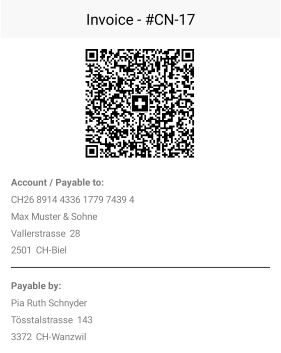
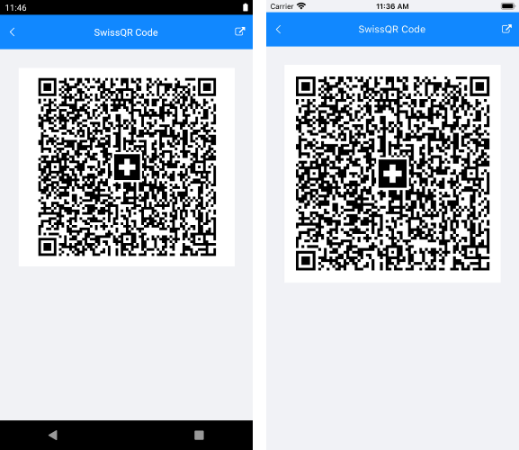

# SwissQR Code

The QR-bill makes issuing and paying invoices simpler, and is being introduced throughout Switzerland to modernize payment transactions. Its most striking feature is the SwissQR Code, which contains all the payment information in a digital format, which can be read using a smartphone or a slip scanner.

The following image shows a Swiss QR-bill.



The SwissQR Code encodes all the information necessary for a payment in a specific format and structure. Along with the printed information, the SwissQR Code forms the payment part of the QR-bill. The allowed currencies for payments are CHF and EUR. The QR-Bill also guarantees you compliance with the regulatory requirements arising from the revised Anti-Money Laundering Ordinance.

## Requirements

The SwissQR Code symbol requires an `"M"` error correction level, which means a redundancy or assurance of around 15%.

In addition, the measurements of the SwissQR Code for printing must always be 46 x 46 mm without the surrounding quiet space regardless of the SwissQR Code version. Depending on the printer resolution, the produced SwissQR Code might require size adjustments.

## Generate a SwissQR Barcode

1. To generate a SwissQR Barcode by using Telerik UI for MAUI, set the `Symbology` of the Barcode to `SwissQRCode`.

 <snippet id='swissqrbarcode-example-xaml' />

1. Add the `telerik` namespace:

 ```XAML
xmlns:telerik="http://schemas.telerik.com/2022/xaml/maui"
 ```

1. The SwissQR Code standard mandates that the input provided for the generation of the barcode is strictly formatted. Both validating and generating this input are complex processes and to facilitate them you can use the `SwissQRCodeValueStringBuilder` helper class. Its purpose is to hold the information needed for a SwissQR Code in a type-safe manner, to validate this information, and to generate the input.

  Through its constructor, you need to set the following properties:

  * `Iban`&mdash;The IBAN of the Account/Payable to.
  * `Currency`&mdash;The currency of the payment (CHF or EUR).
  * `Creditor`&mdash;The information of the contact that receives the payment.
  * `Reference`&mdash;The reference information for the payment.
  * `AdditionalInformation`&mdash;The additional information for the payment.
  * `Debtor`&mdash;The information of the contact that makes the payment.
  * `Amount`&mdash;The amount of the payment.
  * `AlternativeProcedure`&mdash;The alternative procedures for the payment.

 ```C#
SwissQRCodeValueStringBuilder qrCodeValue = new SwissQRCodeValueStringBuilder(
      new Iban("CH4431999123000889012", IbanType.QRIBAN),
      SwissQRCodeCurrency.EUR,
      new Contact("Max Muster & Söhne",
      new StructuredAddress("CH", "8000", "Seldwyla", "Musterstrasse", "123")),
      new Reference(ReferenceType.QRR, "210000000003139471430009017"),
      new AdditionalInformation("Order from 15.03.2021", "//S1/10/1234/11/201021/30/102673386/32/7.7/40/0:30"),
      new Contact("Simon Muster", new StructuredAddress("CH", "8000", "Seldwyla", "Musterstrasse", "1")),
      (decimal)1949.75,
      new AlternativeProcedure("Name AV1: UV;UltraPay005;12345", "Name AV2: XY;XYService;54321"));
 ```

1. Add the namespace.

 ```C#
using Telerik.Barcode
 ```

1. Once you've set up the `SwissQRCodeValueStringBuilder`, call its `Validate` method which validates all its fields and the relations between them. The method returns a string which contains the accumulated errors. If no errors occur, `null` is returned. In this case, call the `BuildValue` method of the string builder which will build the string value that will be provided to the Barcode.

 ```C#
 string errors = qrCodeValue.Validate();
 if (string.IsNullOrEmpty(errors))
 {
    this.Barcode.Value = qrCodeValue.BuildValue();
 }
 ```

Invoking the code from the above snippets will generate the following result:



## See Also

- [2D Barcodes Overview]()
