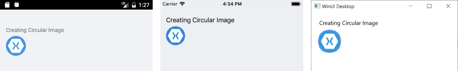

# Corner Radius

Telerik UI for .NET MAUI Border enables you to set a different corner radius to its angles through the `CornerRadius` property.

The `CornerRadius` property represents the degree to which the corners of the Border are rounded. `CornerRadius` is of the `Microsoft.Maui.Thickness` type.

```XAML
<telerikMauiControls:RadBorder BorderColor="#4488F6"
							   BorderThickness="1"
							   CornerRadius="15, 5, 15, 5">
    <Label Text="Hello there" Margin="2" />
</telerikMauiControls:RadBorder>
```


The following image shows the result from that implementation.


Additionally, the wrapped content will be clipped according to the specified corner radius of each side. The following example demonstrates how to render a circle image by wrapping an Image control in a Border.

```XAML
<telerikMauiControls:RadBorder CornerRadius="25"
							   BorderThickness="2"
							   BorderColor="CornflowerBlue">
    <Image Source="XamarinIcon.png"
		   WidthRequest="50"
		   HeightRequest="50" />
</telerikMauiControls:RadBorder>
```


The following image shows the end result.



## See Also

- [Setting the Color of the Border]()
- [Setting the Border Thickness]()
