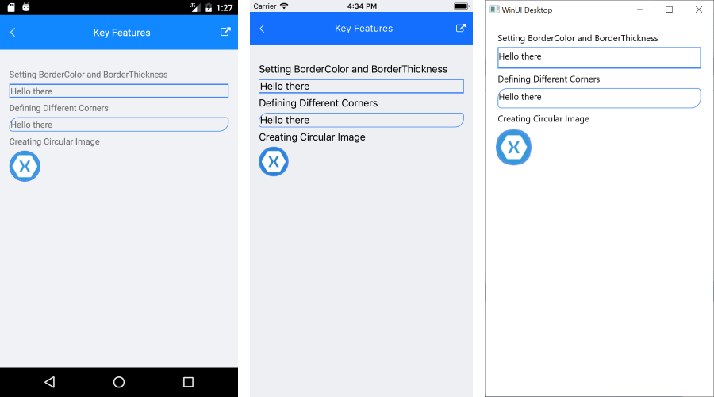

# Color

The Telerik UI for .NET MAUI Border provides the `BorderColor` property, which enables you to specify its color.

If the thickness of the Border is set to `0`, the `BorderColor` property is disabled.

The following figure demonstrates how to set the color of the Border control.  

## See Also

- [Setting the Border Thickness]()
- [Configuring the Corner Radius of the Border]()
