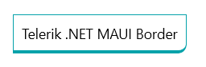

# .NET MAUI Border Styling

The Border control provides options for styling its appearance and enables you to set its color and thickness.

## Border Color

To specify the color of the Border, use the `BorderColor` property. If the thickness of the Border is set to `0`, the `BorderColor` property is disabled.

## Border Thickness

To specify the width of the Border control, use its `BorderThickness` property.

`BorderThickness` is of the `Microsoft.Maui.Thickness` type and allows you to define a different border on each side of the surrounded element.

The following example demonstrates how to use the `BorderColor` and `BorderThickness` properties.

<snippet id='border-features-thickness' />

The following image shows the end result.

## See Also

- [Configuring the Corner Radius of the Border]()
