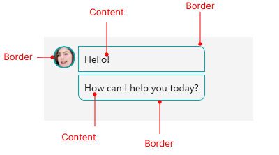

# .NET MAUI Border Visual Structure

The visual structure of the .NET MAUI Border represents the anatomy of the UI component. Being familiar with the visual elements of the Border allows you to quickly find the information required to configure them.

The following image shows the anatomy of the Border.

## Displayed Elements

* **Border**&mdash;The area that surrounds the content and provides visual decoration.
* **Content**&mdash;The content inside the border.

## See Also

* [Getting Started]()
* [Corner Radius]()
* [Setting the Color of the Border]()
