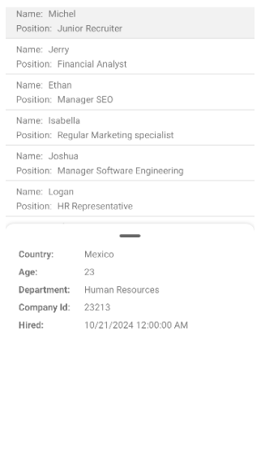
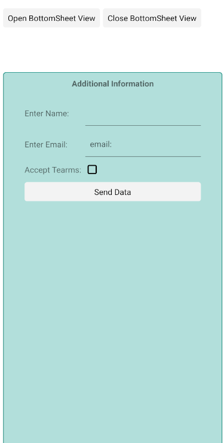

# .NET MAUI BottomSheet Content

The BottomSheet control has two distinct content areas: the _main content_ that serves as the background layer, and the _bottom sheet content_ that slides up to overlay additional information or functionality. You set the main content as the primary child of the control, while the `BottomSheetContent` (`View`) property defines what appears in the sliding panel.

Here is a sample scenario when using the Telerik .NET MAUI [`RadCollectionView`]() in the main content of the BottomSheet and a detailed view in the `BottomSheetContent`.

**1.** Define the sample data model:

<snippet id='bottomsheet-data-model' />

**2.** Define the `ViewModel`:

<snippet id='bottomsheet-view-model' />

**3.** Define the BottomSheet in XAML with `RadCollectionView`:

<snippet id='bottomsheet-animation-swipe' />

**4.** Add the `telerik` namespace:

```XAML
xmlns:telerik="http://schemas.telerik.com/2022/xaml/maui"
```

**5.** Add the following code for the `RadCollectionView.ItemTapped` event handler:

<snippet id='bottomsheet-content-tapped-event' />

This is the result on Android:



> For a runnable example with the BottomSheet Content scenario, see the [SDKBrowser Demo Application]() and review all **BottomSheet** example.

## Setting Custom Control Template

> If you want to review the default BottomSheet templates, add the [TelerikTheming]() to the project and go to `TelerikTheming/Styles/Platform/BottomSheet.xaml` file.


Here is an example setting custom `ControlTemplate`.

<snippet id='bottomsheet-custom-control-template' />

This is the result on Android:



## See Also

- [Animation when opening and closing the bottom sheet]()
- [Style the BottomSheet]()
- [Events]()
- [Methods]()