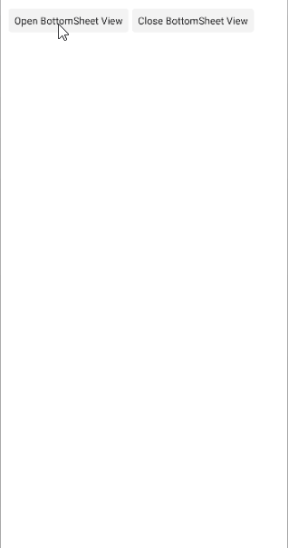

# .NET MAUI BottomSheet Methods

The Telerik UI for .NET MAUI BottomSheet component exposes the `GoToBottomSheetState(string name)` method. Use the method to transition the bottom sheet to a specified [state]().

The example shows how to use the `GoToBottomSheetState(string name)` method:

**1** Define the BottomSheet in XAML:

<snippet id='bottomsheet-getting-started-xaml' />

**2.** Add the `telerik` namespace:

```XAML
xmlns:telerik="http://schemas.telerik.com/2022/xaml/maui"
```

**3.** Call the `GoToBottomSheetState()` method with corresponding state name:

<snippet id='open-bottomsheet-view' />

This is the result on Android:



## See Also

- [Configure the BottomSheet]()
- [Animation when opening and closing the bottom sheet]()
- [Style the BottomSheet]()
- [Events]()

