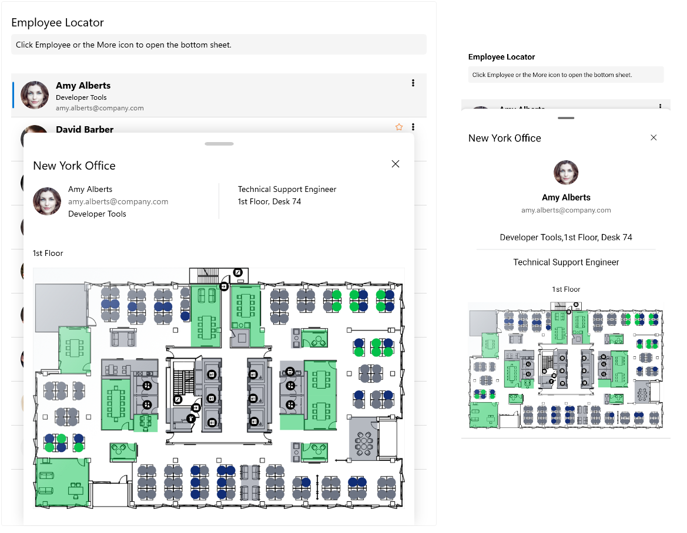

# .NET MAUI BottomSheet Overview

The Telerik UI for .NET MAUI BottomSheet is a UI component that slides up from the bottom of the screen to reveal more content. Use the BottomSheet to display additional information, provide the user with actions or give the option for secondary navigation. 

The control presents the information or actions related to the current screen but it does not cover the full screen.

## Key Features of the Telerik .NET MAUI BottomSheet

* [States]&mdash;The BottomSheet control supports various states like `Full`, `Partial`, `Minimal`, and `Hidden`.
* [Visual Handle]()&mdash;The BottomSheet exposes a visual cue which indicates the control can be dragged.
* [Width]()&mdash;The BottomSheet allows you to set its width.
* [Setting Content]()&mdash;The control allows you to set a content by using the `BottomSheetContent` property.
* [Animation while opening/closing the BottomSheet]()&mdash;The BottomSheet allows you to enable/disable the animation when opening/closing the bottom sheet view.
* [Flexible Styling API]()&mdash;Style the handle and the BottomSheet control by using the exposed styling API.
* [Events]()&mdash;The BottomSheet exposes an event which occurs when the position of the bottom sheet changes. 

## Next Steps

- [Getting Started with the Telerik UI for .NET MAUI BottomSheet]()

## See Also

- [.NET MAUI BottomSheet Product Page](https://www.telerik.com/maui-ui/bottomsheet)
- [.NET MAUI BottomSheet Forum Page](https://www.telerik.com/forums/maui?tagId=1763)
- [Telerik .NET MAUI Blogs](https://www.telerik.com/blogs/mobile-net-maui)
- [Telerik .NET MAUI Roadmap](https://www.telerik.com/support/whats-new/maui-ui/roadmap)
