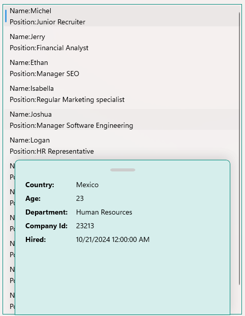
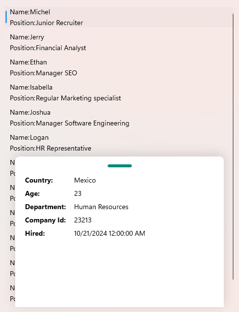

# .NET MAUI BottomSheet Styling

The BottomSheet control offers styling options for both the main container, the bottom sheet content view, and its draggable handle component. You can customize colors, borders, corner radius, and dimensions to match your application's design requirements and create a polished user experience.

To style the BottomSheet control, use the `Style` property (`Style` with target type of `RadBottomSheet`).

To style the view of the `BottomSheetContent`, use the `BottomSheetContentStyle` property (`Style` with target type of `telerik:BottomSheetContentView`).

The available properties are described below:

* `BackgroundColor` (`Color`)&mdash;Specifies the background color of the control.
* `BorderColor` (`Color`)&mdash;Specifies the border color around the control.
* `BorderBrush` (`Brush`)&mdash;Specifies the border brush around the control.
* `BorderThickness` (`Thickness`)&mdash;Specifies the border thickness around the control.
* `CornerRadius` (`Thickness`)&mdash;Specifies the corner radius of the border around the control.

Here is an example of the BottomSheet styling.

**1.** Define the BottomSheet in XAML:

<snippet id='bottomsheet-style' />

**2.** Define the `RadBottomSheet` style in page's resources:

<snippet id='bottomsheet-style-resource' />

**3.** Define the `BottomSheetContentView` style in page's resources:

<snippet id='bottomsheet-content-style-resource' />

**4.** Add the `telerik` namespace:

```XAML
xmlns:telerik="http://schemas.telerik.com/2022/xaml/maui"
```

Here is the result of styling the BottomSheet and `BottomSheetContent`. The `BottomSheetContent` opens when tapping on an item from the CollectionView:



> For a runnable example with the BottomSheet Style scenario, see the [SDKBrowser Demo Application]() and go to **BottomSheet > Styling** category.

## Handle Styling

The handle of the BottomSheet is a small visual indicator at the top of the control that users can grab to drag and resize the panel. You can style the handle by setting the `HandleStyle` property to the `RadBottomSheet`. The target type of the `HandleStyle` is `BottomSheetHandle`.

The available properties are described below:

* `BackgroundColor` (`Color`)&mdash;Specifies the background color of the control.
* `BorderColor` (`Color`)&mdash;Specifies the border color around the control.
* `BorderBrush` (`Brush`)&mdash;Specifies the border brush around the control.
* `BorderThickness` (`Thickness`)&mdash;Specifies the border thickness around the control.
* `CornerRadius` (`Thickness`)&mdash;Specifies the corner radius of the border around the control.
* `WidthRequest` (`double`)&mdash;Specifies the width of the handle.
* `HeightRequest` (`double`)&mdash;Specifies the height of the handle.

Here is an example of the BottomSheet handle styling.

**1.** Define the BottomSheet in XAML:

<snippet id='bottomsheet-handle-style' />

**2.** Define the `BottomSheetHandle` style in page's resources:

<snippet id='bottomsheet-handle-style-resource' />

**3.** Add the `telerik` namespace:

```XAML
xmlns:telerik="http://schemas.telerik.com/2022/xaml/maui"
```

Here is the result of styling the handle. The BottomSheet content opens when tapping on an item from the CollectionView:



> For a runnable example with the BottomSheet Handle Style scenario, see the [SDKBrowser Demo Application]() and go to **BottomSheet > Styling** category.

## See Also

- [Configure the BottomSheet]()
- [Animation when opening and closing the bottom sheet]()
- [Events]()
- [Methods]()