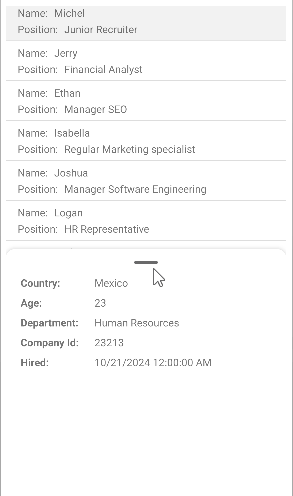

# .NET MAUI BottomSheet Swiping

The BottomSheet control supports intuitive swipe gestures that allow users to close and resize the sheet by dragging up or down on the content area.
This touch-friendly interaction provides a natural way for users to control the BottomSheet's visibility and gives the smooth transition between states with animation, enhancing the overall user experience on mobile and desktop devices.

You can disable the swipe gesture by setting the `IsSwipeEnabled` (`bool`) property. The default value is `true`.

> The animation is always enabled when using the swipe gesture to change the states of the BottomSheet. You can configure the animation settings using the `AnimationDuration` and `AnimationEasing` properties.

Here is a video how the swipe gesture works in the BottomSheet control:

> For a runnable example with the BottomSheet Swipe scenario, see the [SDKBrowser Demo Application]() and go to **BottomSheet > Features** category.

## See Also

- [Animation when opening and closing the bottom sheet]()
- [Style the BottomSheet]()
- [Events]()
- [Methods]()