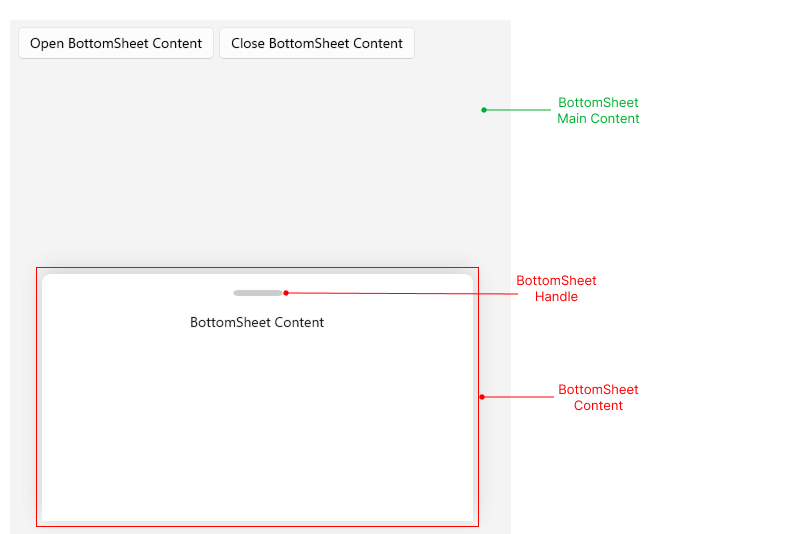

# .NET MAUI BottomSheet Visual Structure

The visual structure of the [.NET MAUI BottomSheet]() represents the anatomy of the UI control. Being familiar with the visual elements of the BottomSheet allows you to quickly find the information required to configure them.

The following image shows the anatomy of the BottomSheet.

* ****&mdash;
