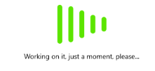

# Custom Busy Content

Setting the `BusyContent` property of BusyIndicator allows you to display any content together with the built-in animations while the control is in its Busy state.

Additionally, you can customize the `BusyContentTemplate` to arrange the custom content and the animated content per your choice.

The following example demonstrates how to customize the busy content.

Apply the `BusyContent` and `BusyContentTemplate` properties.

```XAML
<telerik:RadBusyIndicator x:Name="BusyIndicator"
						 AnimationContentHeightRequest="100"
						 AnimationContentWidthRequest="100"  
						  AnimationType="Animation6"                                            
						IsBusy="True">           
    <telerik:RadBusyIndicator.BusyContent>
        <Label Text="Working on it, just a moment, please..." />
    </telerik:RadBusyIndicator.BusyContent>
    <telerik:RadBusyIndicator.BusyContentTemplate>
        <ControlTemplate>
            <Grid>
                <Grid.RowDefinitions>
                    <RowDefinition Height="Auto" />
                    <RowDefinition Height="Auto" />
                    <RowDefinition Height="*" />
                </Grid.RowDefinitions>
                <ContentPresenter Content="{TemplateBinding Path=AnimationContent}" />
                <ContentPresenter Grid.Row="1"
                                  Content="{TemplateBinding Path=BusyContent}"
                                  HorizontalOptions="Center" />
            </Grid>
        </ControlTemplate>
    </telerik:RadBusyIndicator.BusyContentTemplate>
</telerik:RadBusyIndicator>
```

Add the `telerik` namespace:

```XAML
xmlns:telerik="http://schemas.telerik.com/2022/xaml/maui"
```

The following image shows the result.



## See Also

- [BusyIndicator Animations]()
