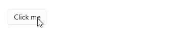

# .NET MAUI Button Command

The Telerik .NET MAUI Button allows you to attach a command that executes when the button is clicked.

* `Command` (`ICommand`)&mdash;Defines the command which executes when the button is clicked.
* `CommandParameter` (`object`)&mdash;Specifies the parameter of the command which executes when the button is clicked.

## Using the Command

The following example demonstrates how to use the `Command`.

**1.** Define the Button in XAML:

<snippet id='button-command-xaml' />

**2.** Add the `telerik` namespace:

```XAML
xmlns:telerik="http://schemas.telerik.com/2022/xaml/maui"
```

**3.** Execute the `Command`:

<snippet id='button-command' />

This is the result on WinUI:



> For a runnable example demonstrating the Button Command, see the [SDKBrowser Demo Application]() and go to the **Button > Features** category.

## See Also

- [Styling the Button]()
- [Creating a Circular Button]()