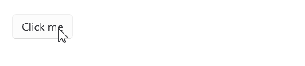

# .NET MAUI Button Command

Use the Telerik UI for .NET MAUI Button `Command` property when you want to trigger view-model logic from the button without handling the click in code-behind. This is the recommended approach for MVVM scenarios.

The Button exposes the following command-related properties:

- `Command` (`ICommand`)&mdash;Defines the command that runs when the button is activated.
- `CommandParameter` (`object`)&mdash;Defines the parameter passed to that command.

## When Should You Use Button Command Binding

Use command binding when you want to:

- Keep button actions in the view model.
- Reuse the same action from multiple UI elements.
- Pass context to the action through `CommandParameter`.

## Using the Command

The following example shows how to bind a command to the Button.

1. Define the Button in XAML:

<snippet id='button-command-xaml' />

2. Add the `telerik` namespace:

```XAML
xmlns:telerik="http://schemas.telerik.com/2022/xaml/maui"
```

3. Implement the `Command`:

<snippet id='button-command' />

The following image shows the result on WinUI:



## Triggering the Same Action from a Key Press

If you want a key press to run the same action, keep the action in an `ICommand` and invoke that same command from your page-level or platform-specific keyboard handling logic. This lets the Button click and the keyboard shortcut reuse the same implementation.

Use this approach when you want both mouse or touch activation and a keyboard-driven trigger for the same operation.

>note
> For a runnable example demonstrating Button command binding, see the [SDKBrowser App]() and navigate to **Button** > **Features**.

## See Also

- [Styling the Button]()
- [Creating a Circular Button]()