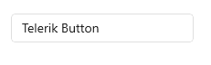
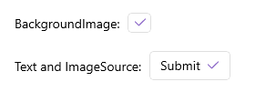

# .NET MAUI Button Configuration


The purpose of this help article is to show you the main configuration options of the control.

## Content Alignment

Use the following properties to align the content in the button when text and image are set.

* `HorizontalContentAlignment` (`Microsoft.Maui.TextAlignment`)&mdash;Specifies the horizontal alignment of the text and image.
* `VerticalContentAlignment` (`Microsoft.Maui.TextAlignment`)&mdash;Specifies the vertical alignment of the text and image.

The following example demonstrates how to apply the `HorizontalContentAlignment` and the `VerticalContentAlignment`.

**1.** Define the Button in XAML:

<snippet id='button-content-alignment' />

**2.** Add the `telerik` namespace:

```XAML
xmlns:telerik="http://schemas.telerik.com/2022/xaml/maui"
```

The following image shows the end result.



> For a runnable example with the Button Content Alignment scenario, see the [SDKBrowser Demo Application]() and go to **Button > Features**.

## Setting Image

Use the following properties to add images in the button:

* `BackgroundImage` (`Microsoft.Maui.Controls.ImageSource`)&mdash;Defines an image as a background of the button.
* `ImageSource` (`Microsoft.Maui.Controls.ImageSource`)&mdash;Defines an image to the button. 

Use the `ContentLayout` (`Microsoft.Maui.Controls.ButtonContentLayout`) property to control the position of the button image and the spacing between the button's image and the button's text

The following XAML shows how to apply an image as a background of the button by using the `BackgroundImage` property.

<snippet id='button-backgroundimage' />

The following XAML shows how to apply an image as part of the button content by using the `ImageSource` property.

<snippet id='button-image' />

This is the end result:



> For a runnable example with the Button Images scenario, see the [SDKBrowser Demo Application]() and go to **Button > Features**.

## Font Options

The following properties specify the font options that apply to the content when `Content` is `string` and `ContentTemplate` is not set.

* `FontFamily` (`string`)&mdash;Specifies the font family of the `Button.Text`.
* `FontSize` (`double`)&mdash;Specifies the font size in pixels of the `Button.Text`.
* `FontAttributes` (`Microsoft.Maui.Controls.FontAttributes`)&mdash;Specifies the font attributes of the `Button.Text`.

## See Also

- [Styling the Button]()
- [Creating a Circular Button]()
