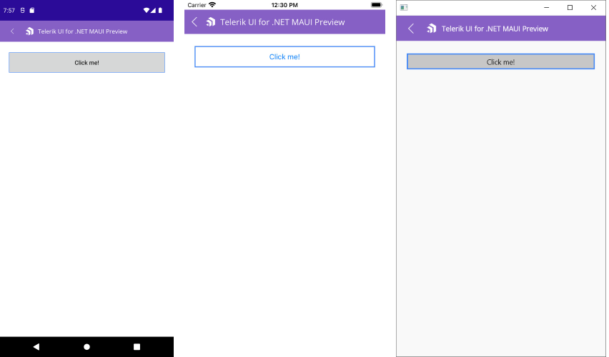

# Getting Started with the .NET MAUI Button

This guide provides the information you need to start using the Telerik UI for .NET MAUI Button by adding the control to your project.

At the end, you will be able to achieve the following result.



## Prerequisites

Before adding the Button, you need to:

1. [Set up your .NET MAUI application](#step-1-set-up-your-net-maui-application).

1. [Download Telerik UI for .NET MAUI](#step-2-download-telerik-ui-for-net-maui).

1. [Install Telerik UI for .NET MAUI](#step-3-install-telerik-ui-for-net-maui).

## Define the Control

1. When the your .NET MAUI application is set up, you are ready to add a Button control to your page.

 <snippet id='button-getting-started-xaml' />

1. Add the `telerik` namespace:

 ```XAML
xmlns:telerik="http://schemas.telerik.com/2022/xaml/maui"
 ```

1. Then define the Click event handler:

 <snippet id='button-getting-started-click-event' />

1. Register the Telerik controls through the `Telerik.Maui.Controls.Compatibility.UseTelerik` extension method called inside the `CreateMauiApp` method of the `MauiProgram.cs` file of your project:

 ```C#
 using Telerik.Maui.Controls.Compatibility;

 public static class MauiProgram
 {
	public static MauiApp CreateMauiApp()
	{
		var builder = MauiApp.CreateBuilder();
		builder
			.UseTelerik()
			.UseMauiApp<App>()
			.ConfigureFonts(fonts =>
			{
				fonts.AddFont("OpenSans-Regular.ttf", "OpenSansRegular");
			});

		return builder.Build();
	}
 }           
 ```

## Additional Resources

- [.NET MAUI Button Product Page](https://www.telerik.com/maui-ui/button)
- [.NET MAUI Button Forum Page](https://www.telerik.com/forums/maui?tagId=1764)
- [Telerik .NET MAUI Blogs](https://www.telerik.com/blogs/mobile-net-maui)
- [Telerik .NET MAUI Roadmap](https://www.telerik.com/support/whats-new/maui-ui/roadmap)

## See Also

- [Positioning the Content of the Button]()
- [Setting the Border Thickness & Color of Button]()
- [Creating a Circular Button]()
