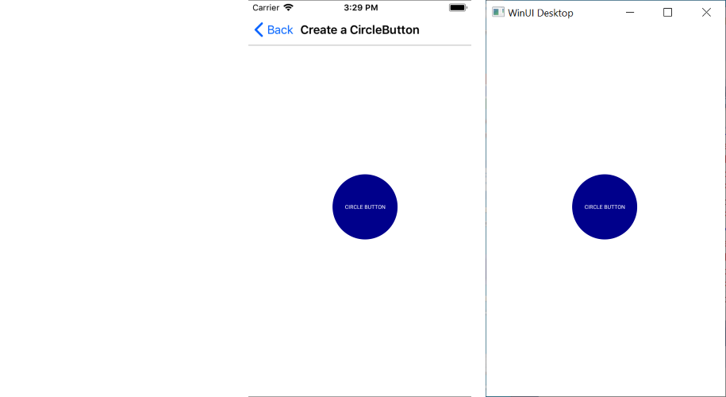

# Creating Circular Buttons

To create a circular button with the Telerik UI for .NET MAUI Button, adjust its `Width`, `Height`, and `BorderRadius` properties.

* `Width` has to be equal to `Height`.
* `BorderRadius` has to be half of the `Width`/`Height` value.

>important In some cases, you may need to set a `BorderWidth` value in order for `BorderRadius` to take effect.

The following example demonstrates how to implement the suggested approach. Note that the `CornerRadius` property is not supported on Android. For more information, refer to article on [implementing the `CornerRadius` support](https://github.com/dotnet/maui/wiki/Status#%EF%B8%8F-button).

```XAML
<telerikInput:RadButton WidthRequest="120"
					    HeightRequest="120"                                
					    Text="Circle Button"
					    FontSize="Micro"
					    TextColor="White"
					    BackgroundColor="DarkBlue"
					    CornerRadius="60"  />
```

Add the namespace:

```XAML
xmlns:telerikInput="clr-namespace:Telerik.XamarinForms.Input;assembly=Telerik.Maui.Controls.Compatibility"
```

The following image shows the end result.



## See Also

- [Button Getting Started]()
