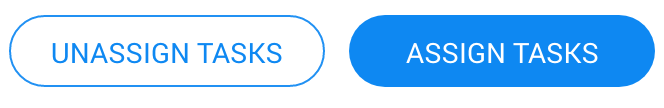

# Overview

**Telerik RadButton for .NET MAUI** enhances the functionality of the standard .NET MAUI Button by providing options for customizing its look and feel. Additionally, it enables you add borders, set its transparency, align its content, define backgrounds, and render images.

## Key Features

* [Content alignment]()&mdash;The Button enables you to easily control the horizontal and vertical positioning of its content.

* [Styling]()&mdash;You can also apply various types of borders around your buttons by using the `BorderThickness` and the `BorderColor` properties.

## Next Steps

- [Getting Started with Telerik UI for .NET MAUI Button]()
- [Creating a Circular Button]()

## See Also

- [.NET MAUI Button product page](https://www.telerik.com/maui-ui/button)
- [.NET MAUI Button forum page](https://www.telerik.com/forums/maui?tagId=1764)
- [Telerik .NET MAUI blogs](https://www.telerik.com/blogs/tag/.net-maui)
- [Telerik .NET MAUI roadmap](https://www.telerik.com/support/whats-new/maui-ui/roadmap)
