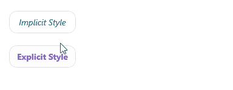

# .NET MAUI Button Styling

The Button provides a set of styling options by exposing properties for customizing its visual appearance.

## Styling the Button

To style the Button, you can use the following properties:

* `Background` (`Brush`)&mdash;Specifies the background brush of the control.
* `BackgroundColor` (`Color`)&mdash;Specifies the background color of the control.
* `BorderColor` (`Color`)&mdash;Specifies the border color of the control.
* `BorderThickness` (`Thickness`)&mdash;Specifies the border thickness of the control. If `BorderWidth` property is set, it will be used with higher precedence and will override the value of the `BorderThickness`.
* `BorderWidth` (`double`)&mdash;Specifies the width of the border, in device-independent units.
* `CornerRadius` (`CornerRadius`)&mdash;Specifies the corner radius of the control.
* `TextColor` (`Color`)&mdash;Specifies the color of the `Button.Text`.

## Example

The following example demonstrates how to apply styling to the `RadButton`.

**1.** Define the Button in XAML:

<snippet id='button-styling' />

**2.** Add the `telerik` namespace:

```XAML
xmlns:telerik="http://schemas.telerik.com/2022/xaml/maui"
```

**3.** Define the resources for explicit button style:

<snippet id='button-styling-explicit' />

**4.** Define the resources for implicit button style:

<snippet id='button-styling-implicit' />

This is the result on WinUI:



> For a runnable example demonstrating the Button Styling, see the [SDKBrowser Demo Application]() and go to the **Button > Features** category.

## See Also

- [Creating a Circular Button]()
