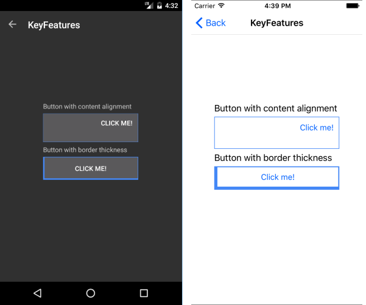

# Styling

To define the border thickness of the Button, use the `BorderThickness` property, which is of the `Microsoft.Maui.Thickness` type. Type `Thickness` allows you to define a different border on each side of the Button.

The snippet below demonstrates how to define the `BorderThickness` property.

```XAML
<telerik:RadButton Text="Click me!"  
				   BorderThickness="6, 2, 2, 6"
				   BorderColor="#4488F6" />
```


The following image shows the end result.



## See Also

- [Creating a Circular Button]()
