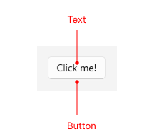

# .NET MAUI Button Visual Structure

The visual structure of the .NET MAUI Button represents the anatomy of the UI component. Being familiar with the visual elements of the Button allows you to quickly find the information required to configure them.

The following image shows the anatomy of the Button.

## Displayed Elements

* **Button**&mdash;The button control that is clickable and can trigger actions.
* **Text**&mdash;The text inside the button.

## See Also

* [Getting Started]()
* [Button Command]()
* [Button Styling]()
